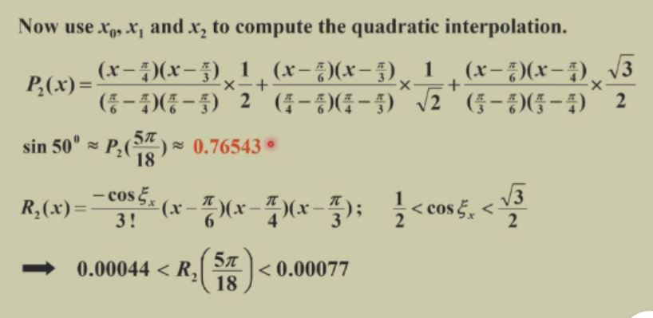

#### 数值分析 第一讲 误差计算
##### 一、数值分析简介
1.目的：解决**根号、幂指函数、微分和积分、矩阵**等的计算问题。   
2.计算过程  
（1）计算方法   
·方法一：**逼近**  
·方法二：**变换**  
（2）判断**计算方法的好坏**，以及**不同情况下各种方法的适用性**。  
3.课程内容  
·**经典逼近方法**的介绍  
·方法的**工作原理**，以及**何时效果好**  
·**科学计算**基础  
##### 二、舍入与计算机代数
1.讨论一：积分逼近
$\int_{0}^{1}e^{x^2}dx$

【解法】泰勒展开  
（1）**何处展开**：此处选择$x=0$，便于计算。  
（2）展开的**项数**与**截断**（`truncation`）  
【解】  
（1）取前4项$S_4$，在$[0,1]$区间上积分进行逼近  
（2）**误差的估计**  
·本计算的**误差**由两部分组成：**舍入误差、截断误差**。    
·**舍入误差**：使用**有限位数的浮点数**，近似表示**前4项的计算结果**，带来的误差。  
·**截断误差**：**丢弃前4项以外的项**引起的误差。  
（3）**误差的计算**  
·**误差计算的关键**：使用**合理的上界**，对误差进行**估计**。   
·**舍入误差**：**两个浮点数四舍五入，3位小数点**，**一个浮点数四舍五入**到**小数点后3位**，带来误差为$0.0005$，则**两个浮点数四舍五入**，舍入误差上限为$0.0005*2 = 0.001$。  
·**截断误差**：根据余项**加减交错、绝对值严格递减的形式**，用**第五项的近似值**作为**截断误差**的**一个上界**。  
2.总结  

（1）**截断误差**：用**级数有限和**近似**级数无穷和**，带来的误差。  
（2）**舍入误差**：用**有限位数的浮点数**，近似表示**无限位数的浮点数**，带来的误差。  
3.**实数的标准化浮点表示**  

·标准表示格式：$\pm 0.d_1d_2\dots d_k * 10^{n}, where \space 1 \leq d_i \le 9\space and \space0 \leq d_i \le 9$
【注】**小数末尾的0有意义**，表示**精确程度**。  
##### 三、浮点运算与误差
1.**浮点数的近似表示**$fl(y)$  
（1）**截断**(`chopping`)：**直接丢弃有限位之后其他**的位。  
（2）**舍入**(`rounding`)：四舍五入、向上、向下、向零、向无穷大舍入等。  
2.**绝对误差**与**相对误差**

（1）绝对误差$|p-p^*|$  
（2）相对误差$\frac{|p-p^*|}{|p|}$  
3.**有效数字定义**

若$t$是**满足$\frac{|p-p^*|}{|p|}<5 \times 10^{-t}$的最大非负整数**，则称该数有$t$位**有效数字**。  
（1）`Chopping`误差分析
·**相对误差定义式**  
·**放缩**：把**分子放大为$1$**，**分母缩小为$0.1$**  
·得到**误差上界**：**$10^{-k+1}$**  
（2）`Rounding`误差分析  
·与`Chopping`步骤类似  
·**分子**只需放大到**$0.5$**  
·得到**误差上界**：$0.5 \times 10^{-k+1}$  
4.【**注意事项一**】**避免大小相近数字相减**  

两个**大小相近**的数字**直接相减**，会导致**有效数字位数减少**，**增大相对误差**。  
【例】  
$a_1 = 0.12345, \space a_2 = 0.12346$  
$a_2 - a_1 = 0.00001$  
$a_1, a_2$均为$5$位有效数字，$a_1 - a_2$有效数字仅有$1$位。    
5.【**注意事项二**】**避免除以很小的数**  

·**除以很小的数，会增大误差**。  
·解决方法：**公式变换**  
·公式正式由计算机运算前，**尽量简化**公式。  
6.【讨论二】**函数计算**  

（1）直接运算：`Chopping`和`Rounding`的相对误差均较大。  
（2）简化：使用秦九韶算法，相对误差减小。  
（3）**乘法误差的估计**  
·$|a+\epsilon_{a}| \cdot |b+\epsilon_{b}|$
##### 四、算法和收敛性
1.算法的**稳定性**

（1）**稳定**：**输入**数据的**小幅度**变化，只会导致**输出**数据的**小幅度变化**。  
（2）**不稳定**：**输入**数据的**小幅度**变化，会**大幅影响输出结果**。  
（3）**条件稳定**：对于**特定输入数据**是**稳定**的，而对于**其他数据不稳定**。  
2.**误差的线性增长、指数增长**——对**稳定性**的**量化**描述

对于算法经过$n$步运算后：  
（1）**指数增长误差**：$E_n = C^{n}E_0$  
（2）**线性增长误差**：$E_n = CnE_0$  
【注】误差增长

·**线性增长误差**通常**不可避免**，若$C, E_0$均**较小**，则算法**可接受**。此时**进一步提高精度**的方法是**增加有效位数，减少$E_0$**；或**减少$C$**。  
·**误差指数增长**的算法，通常需要**避免**。  
3.【例】**计算积分**  
【方法一】**递推法（不稳定）**  

（1）使用递推公式$I_n = 1-nI_{n-1}$  
（2）对于$I_0$的估算：$\frac{1}{e(n+1)}\lt I_n \lt \frac{1}{n+1}$  
（3）误差的**累积**：$|E_n| = n|E_{n-1}| = \dots = n!|E_0|$    
【方法二】**变换公式，改为稳定算法**

（1）变换递推式的形式：$I_{n-1} = \frac{1}{n}(1-I_n)$  
（2）取**大于实际所需**$N$的$N^*$，往**更小**的$N$进行递推。   
（3）$I_{N^*}$的估计：同样**使用不等式$\frac{1}{e(n+1)}\lt I_n \lt \frac{1}{n+1}$进行估计**，取上下界的均值。  
（4）误差的累积：$E_{n} = \frac{1}{N(N-1)\cdots(n+1)}E_{N}$  
【实验提示】
递推法

#### 数值分析 第二讲 单变量方程的解法  
##### 一、二分法
1.介值定理——说明解的存在性

·前提：连续性  
·结论：介于$f(a), f(b)$的函数值对应的根的存在性
2.二分法绝对误差
  
3.二分法收敛条件  
（1）**绝对误差**收敛条件：精确度有限。  
$|p_N - p_{N - 1}| < \epsilon$   
（2）**相对误差**收敛条件：采用相对误差作为收敛条件的实际情况更多，一般更适合作为收敛终止条件。    
$\frac{|p_N - p_{N - 1}|}{|p_N|} \lt \epsilon$
（3）**函数绝对值**收敛条件：$|f(p_N)|<\epsilon$.  
4.计算注意事项：  
判断区间如何二分收紧时，应计算$sign(FA) \cdot sign(FB) > 0$而非$FA \cdot FB> 0$。  
·**后者算出的数值**可能**跳出有效区间**。  
·原因：**有效位数不足**。  
5.二分法的问题  
（1）**收敛速度慢**，可能**丢弃**运算**中间**过程产生的**较为精确的解**。  
（2）无法解决**复根、多重根**的问题。  
##### 二、不动点迭代
1.$f(x) = 0 \leftrightarrow x = g(x)$
·$x$是$f(x)$的**零点**。  
·$x$是$g(x)$的**不动点**。  
2.思想：为了**求解某函数的零点**，可通过**适当的形式变换**，将问题等价转换为**求解另一函数的不动点**。  
3.收敛情况判断
  
运用不动点定理，根据函数在区间内的**导数绝对值**是否$\ge 1$进行判断：前二者收敛，后二者发散。  
4.**不动点定理**
  
（1）前提一（**函数值的有界性**）：$\forall x \in [a, b], g(x) \in [a, b]$.  
（2）前提二（**导数绝对值小于某个位于$(0, 1)$区间的常数$k$**）：区间$[a, b]$中**导数存在**，且其**绝对值小于某个常数$k, 0 < k < 1$**。  
（3）结论：对于$[a, b]$中**任意一个初始点$p_0$**，采取**不动点迭代法**，作迭代$p_n = g(p_{n - 1})$，都能**收敛**于**唯一**的不动点$p$.  
【证明】
（1）由**介值定理**易证**不动点存在性**。  
（2）用**反证法**证明**不动点唯一性**：
假设存在**两个不动点$p, q$**, 则存在点$p, q$之间的一点$\epsilon$使得
$g(p) - g(q) = g'(\epsilon)(p - q) \Rightarrow g'(\epsilon) = 1$，与**导数绝对值被小于1的常数$k$控制的前提矛盾**。  
（3）**不动点迭代收敛性证明**：  
利用**中值定理、导数绝对值小于等于$k$的前提**，有：
$|p_n - p| = |g(p_{n-1}) - p| = |g(p_{n - 1}) - g(p)| = |g'(\epsilon)(p_{n-1} - p)| \le k|p_{n-1} - p| \le \cdots \le k^n|p_0 - p|$.  
5.不动点迭代法的**误差上界**  
$|p_n - p| \le \frac{1}{1 - k}|p_{n+1} - p_n| \cdots (1)$  
$|p_n - p| \le \frac{k^n}{1 - k}|p_1 - p_0| \cdots (2)$  
【理解】  
·在迭代计算过程中，$p$是未知的，因此隐式的绝对误差$|p_n - p|$不能直接作为迭代运算的终止条件，而是应该通过某些变形、放缩处理，获得某些由迭代计算结果描述的、易于计算的显式上界，以之判断迭代运算应于何时终止。  
·$(1)$式用实际计算所得相邻两项的误差$|p_{n + 1} - p_n|$，描述了$|p_n - p|$的一个误差上界，可以作为**算法的终止条件**。  
·$(2)$式可以**估计迭代次数，减少无效计算**。  
·$k$值尽量**缩小**，可以**减少迭代次数**。  
6.【例】使用**不同的函数形式进行不动点迭代**  
下列各函数均用于方程$x^3 + 4x^2 - 10 = 0$在区间$[1, 2]$内根的计算，但由于形式上的差异，而导致不动点迭代的收敛性、收敛速率各不相同。    
  
（1）对$g_i(x)$求导，通过导数绝对值的上界，对不动点迭代的效果好坏进行判断。  
（2）$g_1(x)$两边同时添加$x$，不作其他变形：求导发现绝对值超过$1$，希望不大。  
（3）后三个函数形式恰当，可以满足不动点迭代的充分条件。  
【**思考**】**如何得到上述各式**？
##### 三、不动点迭代——牛顿迭代法
1.基本思想：使用**一阶泰勒展开式**，对一个**非线性方程**进行**线性化**处理，以达到化繁为简的目的。  
2.算法推导过程与特点  
（1）推导过程
  
·对$f(p)$在点$p_0$处进行一阶`Taylor`展开，下列式子近似成立：  
$f(p) \approx f(p_0) + f'(p_0)(p - p_0)$  
·利用上式求解$p$，即得$p \approx p_0 - \frac{f(p_0)}{f'(p_0)}$  
·上式获得的$p$即作为$p_1$，再将$p_1$输入迭代式子，进行下一步迭代，由此获得的迭代公式为：  
$p_n = p_{n - 1} - \frac{f(p_{n - 1})}{f'(p_{n - 1})}$  
（2）算法特点  
·算法精确的前提：二阶项$(x - p_0)^2$足够小，可以舍弃。  
·思想：使用**线性函数逼近原始函数**。  
3.**牛顿迭代法收敛性定理**（**求解函数零点**）
  
·前提：**二阶连续可导**，且其零点$p$满足$f(p) = 0, f'(p) \ne 0$。  
·结论：存在$\delta > 0$，使得对**任意初始点$p_0 \in [p - \delta, p + \delta]$**，运用牛顿法迭代，所得序列**都可以收敛**于$p$.  
  
【证明】  
牛顿迭代法即$p_n = g(p_{n - 1})$，满足：  
$g(x) = x - \frac{f(x)}{f'(x)}$  
（1）$g(x)$在$p$的$\delta$邻域内的**连续性**：  
由二阶连续可微，$p'(x) \ne 0$易证。  
（2）$|g'(x)|$被**常数$0 < k < 1$控制**在$p$的$\delta$邻域内：  
由于$g'(x) = \frac{f(x)f''(x)}{f'(x)^2}$，$g'(p) = 0$，且$g'(x)$连续，故存在某邻域，使得$|g'(x)| < k, 0 \lt k \lt 1, k \in R$.  
（3）$g(x)$将**区间**$[p - \delta, p + \delta]$**映射**到$[p - \delta, p + \delta]$：  
$|g(x) - p| = |g(x) - g(p)| = |g'(\epsilon)(x - p)| \le k |x - p| \lt |x - p| \lt \delta$.  
【注】**$p_0$的选取对迭代结果的影响较大**。  

#### 数值分析 第三讲  
##### 一、一元方程组迭代解法的误差分析  
1.收敛的阶数与渐进误差    
设$\{p_n\} \rarr p$，若存在正常数$\alpha, \lambda$，使得：  
$lim_{n \rightarrow \infty} \frac{|p_{n+1} - p|}{|p_n - p| ^ \alpha} = \lambda$
称：序列$\{p_n\}$收敛于$p$的**阶数为$\alpha$，渐进误差是$\lambda$**.  
【理解】**收敛阶数**$\alpha$**越大**，收敛**速度越快**。  
2.**$g'(p) \ne 0$**时迭代方法的**收敛阶**：  
$lim_{n \rightarrow \infty} \frac{|p_{n+1} - p|}{|p_n - p|} = lim_{n \rightarrow \infty} \frac{g'(\xi_{n})|p_n - p|}{|p_n - p|} = |g'(p)|$  
结论：**线性收敛**。  
3.牛顿法的收敛阶  
（1）根据一阶泰勒展开有：  
$f(p) = f(p_n) + f'(p_n)(p - p_n) + \frac{f''(\xi_n)}{2}(p - p_n) ^ 2$  
（2）牛顿迭代法收敛阶推导  
·注意到：上式中，使用$p_{n + 1} = f(p_n) + f'(p_n)(p - p_n)$进行迭代，即**取一阶泰勒展开，截断含二阶导数的项**。   
·因此有：    
$\frac{|p_{n+1} - p|}{|p_n - p|^2} = \frac{f''(\xi_n)}{2f'(p_n)}$  
（3）结论  
·只要$f'(p) \ne 0$，牛顿法**至少是二阶收敛**。  
·牛顿法在**单根附近**收敛**较快**。  
4.牛顿法中$\alpha, \lambda$的确定  
【定理】（特殊情况）设$p$是$g(x)$的一个**不动点**，若：  
（1）存在常数$\alpha \ge 2$使得$g \in C^\alpha[p - \delta, p + \delta]$（条件一：函数**在不动点$p$附近$\alpha$阶连续**）  
（2）$g'(p) = \cdots = g^{(\alpha - 1)(p)} = 0, g^{(\alpha)}(p) \ne 0$（条件二：不动点$p$的$\alpha$**阶导数非0，且$0 - \alpha - 1$阶导数均为$0$**）  
则不动点迭代$p_n = g(p_{n-1})$是$\alpha$**阶收敛**的。  
【理解】上述定理可以用于推导**牛顿法二阶收敛的特殊情形**，是对牛顿法收敛阶数的**更一般**刻画。  
5.**渐进误差常数**$\lambda$的确定  
$\lambda = \frac{g^{(\alpha)}(\xi_n)}{\alpha !}$  
6.**牛顿法在非单根（重根）时的收敛情况**  
（1）若$p$是$f$的$m$重根，则$f(x) = (x - p)^m q(x), q(p) \ne 0$.    
（2）牛顿法是针对函数$g(x) = x - \frac{f(x)}{f'(x)}$的不动点迭代，从而对于函数$g(x)$有：
$|g'(p)| = |1 - \frac{f'(p)^2 - f(p)f''(p)}{f'(p) ^ 2}| = |\frac{f(p)f''(p)}{f'(p) ^ 2}| = |\frac{m - 1}{m}| < 1$.  
结论：**线性收敛**，但**不是二阶收敛**。  
7.**牛顿法加速收敛的方式**  
（1）对问题进行**等价变形**，使函数$f$的**多重根**$p$变成**另一函数**的**单根**，从而使**线性收敛**变成**二阶收敛**。  
（2）**转化函数的构造**：令$\mu(x) = \frac{f(x)}{f'(x)}$，则函数$f$的多重根即为函数$\mu$的**单根**。  
（3）对函数$\mu$作**牛顿迭代**：$g(x) = x - \frac{\mu(x)}{\mu'(x)} = x - \frac{f(x)f'(x)}{f'(x)^2 - f(x)f''(x)}$ ，则实现了**收敛速度的增大**。  
（4）上述算法的不足之处  
·计算**二阶导数**$f''(x)$，带来了**额外的计算开销**。  
·**分母**为**两项之差**，这两项**可能都接近$0$**.  
##### 二、一些加快收敛速度的迭代方法  
1.`Aitken`$\Delta ^2$（二阶差分）不动点迭代法  
（1）迭代公式  
·$\hat{p}_n = p_n - \frac{(p_{n+1} - p_n)^2}{p_n - 2p_{n+1} + p_{n+2}}$
·$p_n = g(p_{n - 1})$  
·$g(x) = x - \frac{\mu(x)}{\mu '(x)}$
迭代过程中，$\hat{p}_n$需由$p_n, p_{n + 1}, p_{n + 2}$共同确定。    
（2）迭代计算过程  
·给定初始点$p_0$，计算：$p_1 = g(p_0), p(2) = g(p_1)$。  
·计算$\hat{p}_0 = p_0 - \frac{(p_1 - p_0)^2}{p_0 - 2p_1 + p_2}$，以及$p_3 = g(p_2)$；其余迭代计算依次类推。  
2.【定义】**前向差分**  
（1）**一阶前向差分**：$\Delta p_n = p_{n+1} - p_n$
（2）**高阶前向差分**：$\Delta^k p_n = \Delta(\Delta^{k - 1}p_n)$
（3）**`Aitken`方法**的**差分表达式**：$\hat{p} = p_n - \frac{(\Delta p_n)^2}{\Delta^2 p_n}$.  
3.【定理】`Aitken`序列$\{\hat{p}_n\}$的**加速收敛性**  
设**序列**$\{p_n\}$**线性收敛**于$p$，且对任意足够大的$n$有：
$(p_n - p)(p_{n+1} - p) > 0$（**相邻两项分别位于不动点$p$的两端**）
则：
`Aitken`序列$\{\hat{p}_n\}$**收敛于$p$的速度快于序列$\{p_n\}$**，即：
$lim_{n \rightarrow \inf} \frac{\hat{p_n} - p}{p_n - p} = 0$.  
4.`Steffensen`方法  
（1）若$g(x) = x - \frac{\mu(x)}{\mu'(x)}$满足$g'(p) \ne 1$，则**该方法可达到局部二阶收敛**。  
（2）方法：**两次牛顿迭代、一次$Aitken$迭代交替**进行。  
（3）计算过程  
·给定初始点$p_0^{(0)}$，计算$p_1^{(0)} = g(p_0^{(0)}), p_2^{(0)} = g(p_1^{(0)})$  
·计算$p_1^{(0)} = \{\Delta^2\}(p_0^{(0)}), p_1^{(1)} = g(p_1^{0}), p_2^{(1)} = g(p_1^{(1)})$；其余迭代过程以此类推。  
##### 三、高斯消元法——直接求解线性方程组  
1.步骤：  
（1）将矩阵变换为上三角矩阵。  
（2）使用`backward-substitution`进行替换，解决未知方程。  
2.方程组的矩阵形式  
令  
$A^{(1)} = A = (a_{ij}^{(1)})_{n \times n}, \vec{b}^{(1)} = \vec{b} = \begin{bmatrix}
b_1^{(1)} \\
\cdots \\
b_n^{(1)} 
\end{bmatrix}$  
方程组形式为：$A\vec{x} = \vec{b}$.

#### 数值分析 第四讲  
##### 一、消元法解线性方程组  
1.**系数矩阵**$A$化成**上三角矩阵**    
（1）若$a_{11} \ne 0$，计算$m_{i1} = \frac{a_{i1}}{a_{11}}$，令行$i, i \ge 1$减去$m_{i1}r_1$.  
目的是：使得**除了第一行**，**其余各行$x_1$的系数均为$0$**.  
（2）完成上述步骤后，问题转化为$n-1$维的**子问题**，其中：  
$a_{ij}^{(2)} = a_{ij} - m_{i1}a_{1j}$
$b_i^{(2)} = b_i^{(1)} - m_{i1}b_1^{(1)}$  
（3）按上述方法迭代消元，$n-1$次迭代后形成上三角矩阵。  
（4）将$a_{kk} \ne 0$称为`pivot element`.  
[注]  
若第$i$轮迭代时，**对角元$a_{ii}^{(i)} = 0$**，则在进行**行变换前**，需**寻找某个整数**$k \gt i$，满足$a_{ki}^{(i)} \ne 0$，将行$k$与行$i$进行**交换**。  
2.**向后替换**(`Backward Substitution`)  
$x_n = \frac{b_n^{(n)}}{a_{nn}^{(n)}}$
$x_i = \frac{b_i^{(i)} - \Sigma_{i+1}^na_{ij}^{(i)}x_j}{a_ii^{(i)}}$.  
3.消元后$a_{nn} = 0$时方程组解的情况  
（1）$b_n = 0$，方程组有**无穷多解**。  
（2）$b_n \ne 0$，方程组**无解**。  
4.$a_{ii} = 0$时，需从后续行中寻找非$0$系数$a_{ki}, k \ge i$，将$i, k$两行互换。  
（1）若**能找到**$k$，则**互换后继续进行迭代**即可。  
（2）若**找不到**$k$，则该方程组**无解/有无穷多解**。  
5.消元法的**操作次数与时间复杂度**  
【注】**一次乘法/除法**作为一次**单位操作**。  
（1）计算消元系数：$O(n^2)$.  
（2）**行减法**：$O(n^3)$.  
【例1】**高斯消元法**涉及的**乘除操作次数**  

##### 二、主元策略——高斯消元法的改进方法  
[注]  
（1）主元策略应用于**消元**过程，目的是尽可能**减少高斯消元带来的误差**。
（2）较小的主元可能带来一些计算问题，下列方法的共性是：在某个范围内寻找**最大系数**，将该**系数**作为**当前迭代的主元**。  

1.策略一：**部分主元法/最大列主元法**  
对于第$i$轮消元，将**第$i$列最大系数**设置为**主元**。  
（1）寻找最小的$p \ge k$，使得$|a_{pk}^{(k)}| = max_{k \le i \le n}|a_{ik}^{(k)}|$.  
（2）对第$p, i$列进行交换。  
2.策略二：**主元放缩法**   
对于第$k$轮消元： 
（1）对于每一行$1\le i \le n$，寻找行中的最大元素$s_i = max_{1 \le j \le n}|a_{ij}|$，将其作为放缩因子。  
（2）寻找最小的$p \ge k$，满足$\frac{|a_{pk}^{(k)}|}{s_p} = max_{k \le i \le n} \frac{|a_{ik}^{(k)}|}{s_i}$，并交换第$p, k$行。  
[注]对于第$k$轮消元，针对第$i$行($k \le i \le n$)，分别计算该行第$k$列元素$a_{pk}^{(k)}$和该行放缩因子$s_p$的比值，然后逐行比较该比值的大小。比值最大者即为主元所在行。    
3.策略三：**完全主元法**  
**遍历系数矩阵**以**寻找最大系数**，使用行交换以调整主元。  
4.时间复杂度  
（1）部分主元法：$O(n^2)$次比较。  
（2）主元放缩法：$O(n^2)$次比较、$O(n^2)$次除法。  
（3）完全主元法：$O(\frac{n^3}{3})$比较。  
[注]若每次行交换后，需确定新的放缩因子，则主元放缩法需要$O(\frac{n^3}{3})$次比较和$O(n^2)$次除法。  

##### 三、矩阵分解(`Factorization`)  
1.矩阵形式的高斯消元法  
（1）高斯消元对应的行变换矩阵  
$L_1 = \begin{bmatrix}
1 \ 0 \ \cdots\ 0 \\
-m_{21} \ 1 \ \cdots \ 0 \\
\cdots \\
-m_{n1} \ 0 \ \cdots \ 1 \\
\end{bmatrix}$  
（2）高斯消元结果的矩阵形式  
·将$L_1$作用于增广矩阵$[A, \vec{b}]$，得到：  
$L_1[A^{(1)}, \vec{b}^{(1)}] = 
\begin{bmatrix}
a_{11}^{(1)} \ a_{12}^{(1)} \cdots \ a_{1n}^{(1)} \ b_1^{(1)} \\
0 \ a_{12}^{(1)} \ \cdots \ a_{2n}^{(1)} \ b_2^{(2)}
\\ \cdots
\\ 
0 \ a_{n2}^{(1)} \ \cdots \ a_{nn}^{(1)} \ b_n^{(2)}
\end{bmatrix}$
（3）高斯消元$L_k ^{-1}$  
只需去除左下角各系数$-m_{k+1, k}, \cdots ,- m_{n, k}$的负号，其余项均为$1, 0$，保持不变。  
2.系数矩阵$A$的`LU`分解
·系数矩阵$A$可分解为$A = LU$的形式，其中$L$是**下三角矩阵**，$U$是**上三角矩阵**。  
·矩阵$L = L_1^{-1} L_2^{-1} \cdots L_{n-1}^{-1}$，即各高斯消元矩阵的逆矩阵的乘积。   
上述式子称为矩阵$A$的`LU`分解。  
3.`LU`分解对线性方程组求解的好处  
·对于$AX = \vec{b_1}, \vec{b_2}, \cdots$这样一组**系数矩阵相同**，**仅常数向量$\vec{b}$不同**的方程组的求解，可根据$LUx = b$作两步求解：
$Ly = b, y = Ux$。  
·注意到矩阵$L, U$分别为**下三角、上三角矩阵**，因此方程组求解的**时间复杂度**得到了**显著降低**。  
4.【定理】  
（1）若高斯消元法在**不进行行交换**的情况下，可以用于$A\vec{x} = \vec{b}$的求解，则矩阵$A$可以**直接分解**为**下三角**矩阵$L$和**上三角**矩阵$U$的乘积。  
（2）若令$L$的**对角线全为1**(`unitary`)，则对系数矩阵$A$的`LU`分解是**唯一**的。  
【证明】  
用反证法。
设$L$的对角线全为1时，分解不唯一，
即存在一组矩阵$L_1, U_1, L_2, U_2$，
使得：$A = L_1U_1 = L_2U_2$
则：$U_1U_2^{-1} = (L_1^{-1}L_2U_2)U_2^{-1} = L_1^{-1}L_2$  
注意到$U_1U_2^{-1}$为上三角矩阵，$L_1^{-1}L_2$为对角线全为$1$的下三角矩阵，故有：  
$U_1U_2^{-1} = L_1^{-1}L_2 = I$.  
从而$U_1 = U_2, L_1 = L_2$，$L$的对角线全为$1$时，`LU`分解唯一性得证。  
[注]`Crout`分解  
·`Crout`分解方法：令$U$的对角线全为$1$。  
·先对转置$A^T$作$LU$分解，则$A = U^TL^T$即为原矩阵的`LU`分解。  
##### 四、一些特殊系数矩阵及其在方程组求解中的优势  
1.【定义】严格对角占优矩阵
$|a_{ii}| \gt \Sigma _{j = 1, j \ne i} ^n |a_{ij}|$。  
2.【定理】**严格对角占优矩阵的一些性质**  
任何一个严格对角占优矩阵都具有下列性质：  
（1）**非奇异**。  
（2）使用**高斯消元法**求解线性方程组时，**无需交换行、列**。  
（3）**高斯消元计算**对于**取整误差**是**稳定**的。  
3.正定矩阵  
（1）定义  
若矩阵$A$满足$\vec{x}^TAx \gt 0, \forall \vec{x} \ne 0$，则称其为**正定矩阵**。    
（2）性质  
·正定矩阵$A$的**逆矩阵**$A^{-1}$也是**正定**矩阵。  
·$max|a_{ij}| \le max|a_{kk}|$
·$(a_{ij})^2 \lt a_{ii}a_{jj}, \forall i \ne j$.  
（3）等价定义  
矩阵$A$是**正定**矩阵$\Leftrightarrow$矩阵$A$的**各个顺序主子式行列式均为正**。  
4.**正定矩阵的矩阵分解**——`Choleski`分解法  
（1）令上三角矩阵$U = D\tilde{U}$，其中：矩阵$D$为对角矩阵，$D$的各个对角元恰好等于$U$的各个对角元；矩阵$\tilde{U}$为上三角矩阵，对角元均为$1$，非对角元与$D$相同。  
（2）正定矩阵$A$必定是对称的，从而有$L = \tilde{U}^t$，从而$A = LDL^t$。  
（3）又令$D^{\frac{1}{2}}$为对角矩阵$D$各对角元开根号所得矩阵，令$\tilde{L} = LD^{\frac{1}{2}}$，从而有：  
$A = \tilde{L}\tilde{L}^t$.  
5.正定矩阵分解——`Choleski`分解**算法步骤**  
6.**三对角矩阵的分解方法——`Crout`归约**  
（1）对于线性方程组$A\vec{x} = \vec{b}$，三对角矩阵$A$可通过`Crout`归约方法实现`LU`分解，其中：  
·下三角矩阵$L$的**主对角线，以及主对角线下方与之相邻的对角线上**具有**非零元**，其余元素均为$0$。  
·上三角矩阵$U$的**主对角线，以及主对角线上方与之相邻的对角线上具有非零元**，其余元素均为$0$。  
（2）原问题等价转化为求解下列两个系数矩阵分别为下三角、上三角矩阵的线性方程组，从而降低求解的时间复杂度：  
·$L\bar{y} = \bar{f}$。  
·$U\bar{x} = \bar{y}$。  
7.【定理】一类特殊三对角系数矩阵
若系数矩阵$A$既是三对角矩阵，又是对角占优矩阵，且$|b_1| \gt |c_1| \gt 0, |b_n | \gt |c_n| \gt 0, a_i \ne 0, c_i \ne 0$，则：  
该系数矩阵是**非奇异**矩阵，相应的线性方程组可以解出。  
[注]  
（1）若矩阵$A$是严格对角占优的，则无需令所有元素$a_i, b_i, c_i$均为非零元。  
（2）计算量：$O(n)$。  
（3）计算过程中的所有数值都收到矩阵$A$元素初始值的限制，因此相应的求解方法是稳定的。  
[注]本定理中，系数$a_i, b_j, c_k$的定义详见前述`PPT`课件。  
##### 五、迭代法求解稀疏大规模线性方程组
1.思想：类比于解方程$f(x) = 0$中的不动点迭代法。  
2.格式变换：将$A\bar{x} = \bar{b}$变形为$\bar{x} = T\bar{x} + \bar{c}$。  

#### 数值分析 第五讲 迭代法求解稀疏大规模线性方程组  
##### 一、基本定义  
1.迭代方法设计需要考虑问题  
（1）如何设计迭代方案。  
（2）迭代方法的收敛性。  
（3）收敛速度。  
（4）误差估计。  
2.【定义】向量范数$|| \cdot ||$  
（1）正定性  
$||\vec{x}||\ge 0; ||\vec{x}|| = 0 \lrArr \vec{x} = \vec{0}$  
（2）齐次性  
$||\alpha \vec{x}|| = \alpha ||\vec{x}||$  
（3）三角不等式  
$||\vec{x} + \vec{y}|| \le ||\vec{x}|| + ||\vec{y}||$  
3.【定义】无穷范数  
$||\vec{x}||_{\infin} = max\{x_i\}, 1 \le i \le n$  
4.【定义】向量的收敛性  
[理解]用$\vec{x^{(k)}}, \vec{x}$之差的范数的收敛性进行刻画。  
5.【定理】向量序列的收敛性$\lrArr$向量各分量的收敛性  
[理解]向量序列收敛于某一向量 $\lrArr$ 向量的每一个分量，收敛于各自对应的极限。   
6.【定义】向量范数的等价性  
若存在常数$C_1, C_2$，使得$C_1||\vec{x}||_B \le ||\vec{x}||_A \le C_2||\vec{x}||_B$成立，则称向量范数$||\cdot||_A$和$||\cdot||_B$是等价的。    
7.矩阵范数的性质  
矩阵范数基于某向量范数$||\cdot||$进行定义，并具有如下性质：  
（1）基本性质：正定性、齐次性、三角不等式。  
（2）**一致性**：$||AB|| \le ||A|| \cdot ||B||$  
8.【定义】矩阵的佛罗贝尼乌斯范数  
（1）定义：$||A||_F = \sqrt{\Sigma_{i = 1}^{n}\Sigma_{j = 1}^{n}|a_{ij}|^2}$.  
（2）理解：将整个矩阵当作一个大向量，计算$L_2$范数。  
9.【定义】矩阵的自然范数  
（1）定义：$||A||_p = max_{\vec{x} \ne 0} \frac{||A\vec{x}||_p}{||\vec{x}||_p} = max_{||\vec{x}||_p = 1}||A\vec{x}||_p$  
（2）理解：对于**方向任意的单位向量$\vec{x}$**，计算$||A\vec{x}||$的**最大值**作为其范数。  
（3）性质  
·**矩阵的无穷范数**，即为**同一行元素绝对值之和的最大值**：$||A||_\infty = max_{1 \le i \le n} \Sigma_{j = 1}^{n}|a_{ij}|$  
·**矩阵的$L_1$范数**，即为**同一列元素绝对值之和的最大值**：$||A||_1 = max_{1 \le j \le n} \Sigma_{i = 1}^n|a_{ij}|$  
·$||A||_2 = \sqrt{\lambda_{max}(A^TA)}$  
【证明】下证$||A||_\infty = max_{1 \le i \le n} \Sigma_{j = 1}^{n}|a_{ij}|$  
（1）首先证明：$||A||_{\infty} = max_{||\vec{x}||_\infty = 1}||A\vec{x}||_\infty \le max_{1 \le i \le n} \Sigma_{j = 1}^{n}|a_{ij}|$.  
$||A\vec{x}||_{\infty} = max_{1 \le i \le n}|(Ax)_i|（行和最大值）= max|\Sigma_{i = 1}^{n}a_{ij}x_j| \le max_{1 \le i \le n} \Sigma_{j = 1}^{n} |a_{ij}| max|x_j|（提取绝对值放大）$  
（2）再证明：$||A||_{\infty} = max_{||\vec{x}||_\infty = 1}||A\vec{x}||_\infty \ge max_{1 \le i \le n} \Sigma_{j = 1}^{n}|a_{ij}|$  
对于最大的一行$p$，取特殊向量$\vec{x}$，其正负符号跟$\vec{p}$各分量的正负符号相对应，故结论成立。  
##### 二、特征值与特征向量  
1.【定义】谱半径  
将矩阵特征值的最大绝对值称为矩阵的**谱半径**，即：$\rho(A)  max|\lambda|$.  
2.【定理】谱半径不超过矩阵范数    
对于任意类型的自然范数$||\cdot||$，都有：  
$\rho(A) \le ||A||$.  
【证明】$|\lambda|||\vec{x}|| = ||A\vec{x}|| \le ||A||\cdot||\vec{x}||$
（运用了**特征值的基本性质**、**矩阵范数的一致性**）  
3.【定义】矩阵的收敛性  
若$\forall i, j \in [1, n], lim_{k \rightarrow \infty}(A^k)_{ij} = 0$，则称矩阵$A$是收敛的。  
4.**利用矩阵分解简化矩阵收敛性的判断**  
（1）推导  
若系数矩阵可分解为：$A = U Y U^T$，其中矩阵$U, U^T$行列式均为$1$，$Y$为对角矩阵，则有：$A^k = U Y^k U^T$。  
（2）结论  
原系数矩阵$A^k$收敛，等价转化为对角矩阵$Y^k$收敛。  
##### 三、求解稀疏大规模线性方程组的一些迭代方法  
1.`Jacobi`迭代法  
（1）逐行变换：各方程化为类似于$x_1 = \frac{1}{a_{11}}(-a_{12}x_2 - \cdots a_{1n}x_n + b_1)$的形式，使得左边只有$x_i$。  
（2）逐行变换对应的矩阵形式  
设$A$由$D, -L, -U$相加组成，其中$-L, -U$分别为下三角、上三角矩阵，$D$为对角矩阵，则$A\vec{x} = \vec{b} \Leftrightarrow (D-L-U)\vec{x} = \vec{b} \Leftrightarrow D\vec{x} = (L + U)\vec{x} + \vec{b}$。  
从而：$x = D^{-1}(L+U)\vec{x} + D^{-1}\vec{b}$  
（3）迭代公式  
记$T_j = D^{-1}(L+U), c_j = D^{-1}\vec{b}$, 则得到了迭代公式：  
$\vec{x}^{(k)} = T_j \vec{x}^{(k-1)} + c_j$.  
（4）换行操作与系数矩阵奇异性  
为保证$a_{ii} \ne 0, \forall i = 1, 2, \cdots, n$，应进行换行操作；如果换行后某个$a_{ii}$始终为$0$，则$A$为奇异矩阵。  
（5）算法步骤  

[注]对于`Jacobi`迭代法而言，$X^{(k)}$的所有元素完成计算后，$X^{(k + 1)}$才能开始计算，需要两个向量，分别保存$X^{(k)}$和$X^{(k + 1)}$。  
2.`Gauss-Seidel`迭代法  
（1）观察  
·$x_2^{(k)} = \frac{1}{a_{22}}(-a_{21}x_1^{(k)} - a_{23}x_3^{(k - 1)} - \cdots a_{2n}x_n^{(k-1)} + b_2)$  
·此时，$x_1^{(k)}$已经算出，则$x_2^{(k)}$的计算可以利用新计算的$x_1^{(k)}$。  
（2）$x_i^{(k)}$进行迭代计算时，利用的是$x_m^{(k)}, m \lt i$以及$x_m^{(k - 1)}, m \gt i$，即对于下标小于$i$的迭代项，使用第$k$次运算成果；对于下标大于$i$的迭代项，使用第$k - 1$次运算成果。  
（3）`Gauss-Seidel`迭代法的矩阵形式  
$\vec{x}^{(k)} = D^{-1}(L\vec{x}^{(k)} + U\vec{x}^{(k-1)}) + D^{-1}b$  
即：$\vec{x}^{(k)} = (D - L) ^{-1}U \vec{x}^{(k-1)} + (D - L)^{-1}\vec{b}$.  
（4）记号  
·$T_g = (D - L) ^{-1}U, c_g = (D - L)^{-1}\vec{b}$.  
·$T_g = (D - L) ^{-1}U$称为`Gauss-Seidel`迭代矩阵。  
##### 四、迭代方法的收敛性  
$\vec{x}^{(k)} = T\vec{x}^{(k-1)} + \vec{c}$  
1.【定理】**矩阵收敛的等价描述**    
（1）$A$是**收敛矩阵**。  
（2）$lim_{n \rightarrow \infty} ||A^n|| = 0$，对**某类自然范数**成立。  
（3）$lim_{n \rightarrow \infty} ||A^n|| = 0$，对**所有自然范数**成立。  
（4）矩阵$A$的**谱半径**（特征值最大绝对值）**小于1**：$\rho(A) \lt 1$.  
（5）$lim_{n \rightarrow \infty}A^n\vec{x} = \vec{0}, \forall \vec{x}$.  
2.【定理】**通过误差向量判断迭代矩阵$T$的收敛性**  
（1）误差向量：$\vec{e}^{(k)} = \vec{x}^{(k)} - \vec{x}^* = (T\vec{x}^{(k-1)} + \vec{c}) - (T\vec{x}^{*} + \vec{c}) = T\vec{e}^{(k-1)}$  
（2）$T$为**收敛矩阵**的一个**充分**条件：矩阵范数$||T|| \lt 1$.  
（3）$T$为**收敛矩阵**的一个**必要**条件：$\vec{e}^{(k)} \rightarrow  0, k \rightarrow \infty$

#### 数值分析 第六讲  
##### 一、不动点迭代法的收敛性（续）  
1.[回顾]不动点迭代法收敛性
（1）充分条件：若$||T|| \lt 1$，则$||T^k|| \rightarrow  0, k \rightarrow  \infty$，这是迭代法${\vec{x}^{(k)}} = T\vec{x}^{(k-1)} + \vec{c}$收敛的一个充分条件。  
（2）必要条件：$\vec{e}^{(k)} \rightarrow \vec{0}, k\rightarrow \infty, T^k \rightarrow  O$。  

2.【定理1】谱半径与不动点迭代收敛性的关系  
对于任意$\vec{x}^{(0)}\in R^n$，序列${\vec{x}^{(k)}} = T\vec{x}^{(k-1)} + \vec{c}$收敛与于独特解$\vec{x} = T\vec{x} + \vec{c}$，当且仅当**谱半径$\rho(T) \le 1$**.  
【证明】  
（1）给定谱半径$\rho(T) \lt 1$，利用迭代公式，对$\vec{x}^{(k)}$展开得到$\vec{x}^{(k)} = T^k\vec{x}^{(0)} + (T^{k-1} + \cdots+T+I) \vec{c} \rightarrow  (I - T)^{-1}\vec{c}$，因此和式中的两项均收敛。 
[注]教材443页结论：对于收敛矩阵$T$，有：$\Sigma_{j = 0} ^ \infty T^j = (I - T)^{-1}$。   
（2）已知误差极限$lim_{k\rightarrow  \infty}\vec{e}^k = 0$，则$lim _{k \rightarrow  \infty}T^k\vec{e}^{(0)} = 0$，从而必有$\rho(K) \lt 1$.  

3.【定理2】迭代法误差界估计  
（1）已知$\vec{x}$，估计误差界：  
$||\vec{x} - \vec{x}^{(k)}|| \le ||T||^k||\vec{x} - \vec{x}^{(0)}|| \approx \rho^k(T)||\vec{x} - \vec{x}^{(0)}||$  
（2）未知$\vec{x}$，用初始项估计误差界：  
$||\vec{x} - \vec{x}^{(k)}|| \le \frac{||T||^k}{1 - ||T||}||x^{(1)} - x^{(0)}||$  
[注]推导时，注意利用添项法：  
$||\vec{x}^{(0)} - \vec{x}^{(1)}|| = ||\vec{x}^{(0)} -\vec{x} + \vec{x} - \vec{x}^{(1)}|| =  ||(\vec{x}^{(0)} -\vec{x}) - (\vec{x}^{(1)} - \vec{x})|| \ge  ||\vec{x} - \vec{x}^{(0)}|| - ||\vec{x} - \vec{x}^{(1)}|| \ge \frac{1}{||T||^k}||\vec{x} - \vec{x}^{(k)}|| - \frac{||T||}{||T||^k}||\vec{x} - \vec{x}^{(k)}||$  
（3）整理得：  
$||\vec{x} - \vec{x}^{(k)}|| \le \frac{||T||^k}{1 - ||T||}||x^{(1)} - x^{(0)}||$  
（4）该不等式的作用是，计算迭代到指定误差范围所需要的**迭代次数**，根据$||T||$的大小可以得到收敛速度的快慢。  

4.【定理3】严格对角占优阵与迭代法收敛性  
对于**严格对角占优矩阵**$A$，使用雅可比迭代、高斯-塞达尔迭代方法，解线性方程组$A \vec{x} = \vec{b}$，对于**任一初值**$\vec{x}^{(0)}$都是收敛的。  
【证明】证明$\forall |\lambda|\ge 1$，都有$|\lambda I - T| \ne 0$，从而**严格对角占优矩阵的特征值绝对值均小于1**，因此迭代法收敛。  

##### 二、松弛迭代法  
1.[回顾]高斯-塞达尔方法：  
$x_i^{(k)} = \frac{1}{a_{ii}}[b_i -\Sigma _{j = 1}^{i-1}a_{ij}x_j^{(k)} - \Sigma_{j = i+1}^n a_{ij}x_j^{(k-1)}] \newline 
= x_i^{(k-1)} + \frac{r_i^{(k)}}{a_{ii}}$  
其中残差表达式为:  
$r_i^{(k)} = b_i - \Sigma _{j \lt i} a_{ij}x_j^{(k)} - \Sigma_{j \ge i}a_{ij}x_j^{(k-1)}$  
[注]残差的理解  
（1）残差定义$r = b - A \tilde{x}$  
（2）从优化的角度看，残差$r_i^{(k)}$可以看作**梯度方向**。  

2.松弛迭代法的一般形式  
$x_i^{(k)} = x_i^{(k-1)} + \omega \frac{r_i^{(k)}}{a_{ii}}$  
（1）该方法称为松弛迭代法，即控制当前解在“梯度”方向可以更新多少距离。  
（2）通过学习率$\omega$的适当选取，可以**加快收敛速度**。  
（3）$0 \lt \omega \lt 1$：松弛方法。  
（4）$\omega = 1$：高斯-塞达尔迭代法。  
（5）$\omega \gt 1$：超松弛迭代法（`Successive Over-Relaxation Method, SOR`）。  

3.松弛迭代法的矩阵形式  
（1）配项  
$x_i^{(k)} = x_i^{(k-1)}+ \omega\frac{r_i^{(k)}}{a_{ii}} 
\newline = (1 - \omega)x_i^{(k-1)} + \frac{\omega}{a_{ii}}[-\Sigma _{j \lt i}a_{ij}x_j^{(k)} - \Sigma_{j \ge i}a_{ij} x_j^{(k-1)} + b_i]$  
（2）作$LU$分解  
$\vec{x}^{(k)} = (1-w)\vec{x}^{(k-1)} + \omega D^{-1}(L\vec{x}^{(k)} + U \vec{x}^{(k-1)} + \vec{b})$  
（3）改写  
由于$a_{ii}x_i^{(k)} + \omega \Sigma_{j = 1} ^ {i - 1} a_{ij}x_j^{(k)} = (1 - \omega)a_{ii}x_i^{(k-1)} - \omega \Sigma _{j = i + 1}^n a_{ij}x_k^{(k-1)} + \omega b_i$  
故$(D - \omega L)\vec{x}^{(k)} = [(1-\omega)D + \omega U]\vec{x}^{(k-1)} + \omega \vec{b}$  
（4）令$T_\omega = (D - \omega L)^{-1}[(1-\omega)D + \omega U], \vec{c_\omega} = \omega (D - \omega L)^{-1} \vec{b}$，即得到带有学习率$\omega$的松弛迭代表达式。  

4.【定理4】（`Kahan`定理）超松弛方法收敛的必要条件  
若矩阵的**对角元素全部不为$0$**，则$\rho(T_\omega) \ge|\omega - 1|$，这说明：`SOR`方法在$0 \lt \omega \lt 2$时才有可能收敛。  

5.【定理5】（`Ostrowski-Reich`定理）**正定矩阵**超松弛迭代的收敛性  
若$A$是**正定矩阵，且$0 \lt \omega \lt 2$**，则**SOR方法**对于**任意选择的初始近似解**都是**收敛**的。  

6.【定理6】**正定三对角矩阵**的最优学习率  
若$A$是**正定**的**三对角**矩阵，则$\rho(T_g) =  \ [\rho(T_j)]^2 \lt 1$，并且SOR方法的最优$w$为$\omega = \frac{2}{1 + \sqrt{1 - \rho^2(T_j)}}$，且$\rho(T_\omega) = \omega - 1$.  
【注】$T_g = (D - L)^{-1}U, T_j = D^{-1}(L + U)$  

7.【讨论】  
给定$A = \begin{bmatrix} 2 \ 1 \\ 1 \ 2 \\\end{bmatrix}, b = [1 \space 2]^T$，以及迭代方法$\vec{x}^{(k)} = \vec{x}^{(k-1)} + \omega(A \vec{x}^{(k-1)} - \vec{b})$，问：  
（1）$\omega$为多少时，方法会收敛？  
（2）$\omega$为多少时，方法收敛最快？  

【理解】  
上述方法直接利用残差进行学习，可以认为是一种雅可比迭代法。  

【解题思路】  
（1）计算矩阵$I + \omega A$的特征值。  
$\lambda_1 = 1 + \omega, \lambda_2 = 1 + e \omega$.  
（2）求谱半径（矩阵$I + \omega A$最大特征值）最小值。  

##### 三、近似计算矩阵最大特征值——幂次法  
1.[引入]特征值分解  
（1）$A = U \Sigma U^T$，其中$\Sigma$为对角矩阵，各元素即为矩阵的各个特征值。  
（2）分拆：$A = U_1 \lambda_1 U_1^T + \cdots + U_n \lambda_n U_n^T$。  
（3）矩阵近似存储（压缩存储空间）：仅存储最大的前$k$个特征值。  
（4）本章内容：**绝对值最大**的特征值以及相应特征向量的近似计算方法。  

2.假设  
$A$矩阵的特征值满足：$|\lambda_1|\ge |\lambda_2| \ge \cdots \ge |\lambda_n| \ge 0$，相应的$n$个特征向量$\vec{v_1}, \vec{v_2}, \cdots, \vec{v_n}$线性无关。  

3.思想：  
（1）给定任一初始值向量$\vec{x}^{(0)} \ne 0$，且满足初值向量与特征向量$\vec{v_1}$非正交，即$(\vec{x}^{(0)}, \vec{v_1}) \ne 0$，则：  
$\vec{x}^{(0)} = \Sigma_{j = 1}^n \beta_j\vec{v_j}$  
上式表示：$\vec{x}^{(0)}$可由各特征向量进行线性表示。    
（2）对于上述线性表达式，两边同时左乘$A$得：$\vec{x}^{(1)} = A \vec{x}^{(0)} = \Sigma_{j = 1}^n \beta_j\lambda_j\vec{v_j}$，其中$\beta_1 \ne 0$。  
[注]推导依据：$A\vec{x} = \lambda \vec{x}$
（3）$\vec{x}^{(k)}$不断左乘$A$矩阵，从而实现对特征值的近似计算，有：  
$\vec{x}^{(k)} \approx \lambda_1^k\beta_1\vec{v}_1$  
$\vec{x}^{(k-1)} \approx \lambda_1^{k-1}\beta_1\vec{v}_1$  
两个向量各分量相除，即得$\lambda_1$得近似值。  
4.正则化  
（1）针对每一步操作，均无穷范数限制$||\vec{x}^{(k)}||_\infin = 1$，以增强算法的稳定性。  
（2）令$\vec{u}^{(k-1)} = \frac{\vec{x}^{(k-1)}}{|\vec{x}_{p_{k-1}}^{(k-1)}|}, |x_{p_k}^{(k)}| = ||x^{(k)}||_\infin$  
由$\vec{x}^{(k)} = A \vec{u}^{(k-1)}$  
推导出  
$\vec{u}^{(k)} = \frac{\vec{x}^{(k)}}{|x_{p_k}^{(k)}|} \rarr \vec{v_1}$  
$\lambda_1 \approx \frac{x_i^{(k)}}{u_i^{(k-1)}} = x_{p_{k - 1}}^{(k)}$  
5.幂次法——算法步骤  
  
6.注意事项  
（1）若绝对值最大的特征根为多重根，该方法同样适用，原因是：  
$\vec{x}^{(k)} = \lambda_1^k[\Sigma_{j = 1}^r \beta_j \vec{v}_j + \Sigma_{j = r+1}^n \beta_j(\frac{\lambda_j}{\lambda_1})^k \vec{v}_j] \approx \lambda_1^k(\Sigma_{j = 1}^r \beta_j \vec{v}_j)$  
（2）若$\lambda_1 = - \lambda_2$，则算法不收敛。  
（3）对于任一选择的初始值向量$\vec{x}^{(0)}$，不能保证$\beta_1 \ne 0$，故迭代的结果可能不是$\vec{v}_1$，而是首先满足非正交条件的特征值向量$\vec{v}_m$，此时相应的特征值向量为$\lambda_m$。  
（4）`Aitken`方法：加快特征值近似计算方法的收敛速度。  
7.算法收敛率  
（1）观察迭代公式：$\vec{x}^{(k)} = A \vec{x}^{(k - 1)} = \lambda_1^k \Sigma_{j = 1}^n \beta_j (\frac{\lambda_j}{\lambda_1})^k \vec{v_j}$  
（2）收敛率：$|\frac{\lambda_2}{\lambda_1}|$  
##### 四、幂次法的改进思路  
1.假设$|\lambda_2| \ge |\lambda_n|$，令$p  = \frac{\lambda_2 + \lambda_n}{2}$  
  
2.令矩阵$B = A - pI$，则$|\lambda I - A| = |\lambda I - (B+pI)| = |(\lambda - p)I + B|$  
从而有$\lambda_A - p = \lambda_B$  
3.注意到$\frac{|\lambda_2 - p|}{|\lambda_1 - p|} \lt \frac{\lambda_2}{\lambda_1}$，故迭代近似计算$B$的特征值，收敛速度快于直接计算$A$的特征值。  
##### 五、逆幂次法  
1.基本思想  
设$A$的特征值，按照绝对值非升序排列为$\lambda_1, \cdots,  \lambda_n$，则对于$A^{-1}$矩阵，成立：$\frac{1}{|\lambda_n|} \ge \cdots \ge \frac{1}{|\lambda_1|}$  
2.算法目的：计算矩阵$A$**绝对值最小的特征值**。  
3.计算$\vec{x}^{(k+1)} = A^{-1}\vec{x}^{(k)}$的方法  
（1）上式两边左乘$A$，等价于：  
$A \vec{x}^{(k+1)} = \vec{x}^{(k)}$  
（2）使用$LU$分解，解上述线性方程组，即得$\vec{x}^{(k+1)}$。  
4.【思考】已知$\lambda_i$在所有特征值中，最接近一个已知数$p$，问如何更好地近似计算$\lambda_i$？  
【解答】  
（1）已知条件表明$|\lambda_i - p| \lt \lt |\lambda_j - p|$，即矩阵$(A - pI)$中，$\lambda_i - p$为**绝对值最小的特征值**。  
（2）若逆矩阵$(A - pI)^{-1}$存在，则可以通过**逆幂次法**，**计算$(A - pI)^{-1}$的最大特征值**，从而算出$\lambda_i$更加精确的近似值。  
##### 六、插值法和多项式近似——研究背景  
1.设某函数十分复杂，不易获得解析式，只能观察到其中$n$个点的函数值$y_i = f(x_i)$。  
2.若$g(x)$满足$g(x_i) = f(x_i)$，称$g(x)$为函数$f(x)$的**插值函数**。  
3.最常用的插值函数：代数多项式函数。  
##### 七、插值法与拉格朗日多项式  
1.目标：寻找一个$n$阶多项式，$P(n) = a_nx^n + \cdots + a_0$，使得$P_n(x_i) = y_i, i = 0, 1, \cdots, n$  
2.$n = 1$的情形  
（1）$P_1(x) = y_0 + \frac{y_1 - y_0}{x_1 - x_0}(x - x_0) \newline = (\frac{x - x_1}{x_0 - x_1})y_0 + \frac{x-x_0}{x_1 - x_0}y_1$  
（2）拉格朗日系数  
$L_{1, 0}(x) = \frac{x - x_1}{x_0 - x_1}$  
$L_{1, 1} = \frac{x-x_0}{x_1 - x_0}$  
（3）$P_1(x) = \Sigma_{i = 0}^1L_{1, i}(x)y_i$，称$L_{1, i}(x_j) = \delta_{ij}$为**拉格朗日基函数**。  
3.$n \gt 1$的情形  
（1）目标：同样是寻找基函数$L_{n, i}(x_j) = \delta_{ij}$，从而获得插值多项式$P_n(x) = \Sigma_{i = 0}^nL(n, i)(x)y_i$，使得$P_n(x_i) = y_i$。  
（2）各个拉格朗日基函数$L_{n, i}$都有$n$个根，即$x_0, \cdots, \hat{x}_i, \cdots, x_n$  
从而$L_{n, i} = C_i(x - x_0)\cdots (x-x_i) \cdots (x - x_n)$  
（3）注意到$L_{n, i}(x_i) = 1$，从而$C = \Pi _{j \ne i}\frac{1}{x_i - x_j}$  
（4）结论：$L_{n, i}(x) = \Pi_{j = 0, j \ne i}^n \frac{x - x_j}{x_i - x_j}$  
（5）拉格朗日插值多项式：$P_n(x) = \sum_{i = 0}^nL_{n, i}(x)y_i$  
4.【定理】拉格朗日插值多项式的唯一性  
若$x_0, \cdots, x_n$互不相同，$f$在这些点的函数值给定，则$f$的$n$阶插值多项式是**唯一**的。  
【证明】  
（1）用反证法。若否，则存在$P_n(x), Q_n(x)$均满足插值条件。  
（2）构造$D(x) = P_n(x) - Q_n(x)$，至多$n$阶；但是$D(x)$有$n+1$个互不相同的根$x_0, \cdots, x_n$，与$n$阶多项式至多$n$个根的事实形成矛盾。  
[注]  
（1）若插值多项式的度数$\gt n$，则插值多项式不唯一。  
（2）举例：构造$P(x)$，在基本的拉格朗日多项式基础上，添加高阶项，即$P(x) = L_n(x) + p(x)\Pi_{i = 0}^n (x - x_i)$，其中$p(x)$可以是任意阶的多项式。  
##### 八、拉格朗日插值法——误差分析  
1.假设$a \le x_0 \le \cdots \le x_n \le b, f \in C^{n+1}[a, b]$，考虑**截断误差**$R_n(x) = f(x) - P_n(x)$。  
2.回顾——罗尔定理  
（1）$\phi(x_0) = \phi(x_1) = \phi(x_2) = 0$，则$\exists \xi _0 \in(x_0, x_1), \xi_1 \in (x_1, x_2)$，使得$\phi'(\xi_0) = \phi'(\xi_1) = 0$，故存在$\xi'', \phi''(\xi'') = 0$  
（2）对于$n+1$个零点，若函数足够光滑，则$\exists \xi \in (a, b), \phi^{(n)}(\xi) = 0$  
3.误差分析  
（1）考虑误差函数$R_n(x) = f(x) - P_n(x)$  
此函数至少有$n+1$个零点，即原函数零点$x_0, \cdots, x_n$，从而$R_n(x) = K(x) \Pi _{i = 0}^n(x - x_i)$  
（2）定义函数$g(t) = R_n(t) - K(x)\Pi _{i = 0}^n(t - x_i)$，则$g(t)$的$n+2$个零点为$x_0, \cdots, x_n, x$。  
（3）针对$g(t)$函数的$k+1$阶导数有：$\exists \xi_x, g^{(n+1)}(\xi_x) = 0$。  
（4）注意到$g^{(n+1)}(\xi_x) = R_n^{(n+1)}(\xi_x) - K(x)(n+1)! = 0$，作展开$R_n^{(n+1)} = f^{(n+1)}(\xi_x) - P_n^{(n+1)}(\xi_x)$，可得：  
$f^{(n+1)}(\xi_x) - P_n^{(n+1)}(\xi_x)- K(x)(n+1)! = 0$ 
（5）又由于$P_n^{(n+1)}(\xi_x) = 0$，故：  
$K(x) = \frac{f^{(n+1)}(\xi_x)}{(n+1)!}$  
（6）结论  
$R_n(x) = \frac{f^{(n+1)}(\xi_x)}{(n+1)!} \Pi _{i = 0}^n(x - x_i)$  
[注]上式与泰勒多项式余项形式上相似，不同之处是泰勒多项式的余项以$x_0$为$n$重根，而拉格朗日多项式的余项分别以各个零点$x_0, \cdots, x_n$为一重根。  

#### 数值分析 第七讲  
##### 一、矩阵迭代计算方法——误差分析  
1.目的  
分析$A, \vec{b}$的误差对于方程组$A\vec{x} = \vec{b}$的解$\vec{x}$误差的影响。  
2.$\vec{b}$的误差对$\vec{x}$的误差的影响  
（1）设$A$是精确的，$\vec{b}$的误差是$\delta \vec{b}$，则$A(\vec{x} + \delta \vec{x}) = \vec{b} + \delta \vec{b}$  
（2）由上式可导出：$\frac{||\delta \vec{x}||}{||\vec{x}||} \le ||A||\cdot ||A^{-1}||\cdot \frac{||\delta \vec{b}||}{||\vec{b}||}$  
2.【定理1】根据矩阵范数估计$I \pm B$的范数    
设对于某种自然范数而言，矩阵$B$的行列式$||B|| \lt 1$，则:  
（1）$I \pm B$是非奇异矩阵。  
（2）$||(I \pm B)^{-1}|| \le \frac{1}{1 - ||B||}$。  
3.$A, \vec{b}$的误差对$\vec{x}$误差的影响  
（1）$(A + \delta A)(\vec{x} + \delta \vec{x}) = \vec{b}$  
（2）推导结果  
$\frac{||\delta \vec{x}||}{||\vec{x}||} \le \frac{||A^{-1}||\cdot||\delta A||}{1 - ||A^{-1}|| \cdot ||\delta A||} = \frac{||A||\cdot||A^{-1}||\cdot\frac{||\delta A||}{||A||}}{1 - ||A||\cdot||A^{-1}||\cdot\frac{||\delta A||}{||A||}}$  
4.【定义1】条件数  
称$||A|| \cdot ||A||^{-1}$为条件数$K(A)$。  
**[注]**  
**（1）条件数是矩阵迭代计算误差的关键因素**。  
**（2）条件数越大，矩阵越难得到较为精确的近似解。**  
5.【定理2】误差界估计  
设$A$是非奇异矩阵，且$||\delta A|| \lt \frac{1}{||A^{-1}||}$，则方程组$(A + \delta A)(\vec{x} + \delta \vec{x}) = \vec{b} + \delta \vec{b}$的近似解$\vec{x} + \delta \vec{x}$有如下误差上界：  
$\frac{||\delta \vec{x}||}{||\vec{x}||} \le \frac{K(A)}{1 - K(A)\frac{||\delta A||}{||A||}} (\frac{||\delta A||}{||A||} + \frac{||\delta \vec{b}||}{||\vec{b}||})$  
6.几个注意事项  
（1）对称矩阵的条件数：$K(A)_2 = \frac{|\lambda|_{max}}{|\lambda|_{min}}$  
（2）对于任意的自然范数$||\cdot||_p$，都有$K(A)_p \ge 1$。  
（3）$K(\alpha A) = \alpha K(A), \forall \alpha \in R$  
（4）正交矩阵$A^{-1} = A^t$满足$K(A)_2 = 1$  
（5）任取正交矩阵$R$，都有：$K(RA)_2 = K(AR)_2 = K(A)_2$。  
【例1】设$A = \begin{bmatrix}1 & 0.99 \\ 0.99 & 0.98 \end{bmatrix}, \vec{b} = \begin{bmatrix} 1.99 \\ 1.97 \end{bmatrix}$  
（1）计算$K(A)_2$。  
（2）设$\vec{b}$受到扰动$\delta \vec{b} = \begin{bmatrix} -0.97\times 10^{-4} \\ 1.06 \times 10^{-4}\end{bmatrix}$，问方程组的解发生了怎样的变化。  
【解】  
（1）$\lambda_1 = 1.98005, \lambda_2 = -0.00005$  
故$K(A)_2 = |\frac{\lambda_1}{\lambda_2}| = 39206 \gt \gt 1$。  
（2）$\frac{||\delta \vec{b}||_2}{||\vec{b}||_2} = 5.13 \times 10^{-5}$，精确解$\vec{x}^* = \begin{bmatrix} 3 \\ -1.0203 \end{bmatrix}$  
$\delta \vec{x} = \vec{x}^* - \vec{x} = \begin{bmatrix} 2 \\ -2.0203\\ \end{bmatrix}$  
$\frac{||\delta \vec{x}||_2}{||\vec{x}||_2} = 2.0102 \gt 200 %$  
##### 二、拉格朗日插值法（续）  
【例2】求$f(x) = e^x$，各个数精确到小数点后$8$位，问：线性插值近似的步长$h$为多少时，绝对值的误差$\lt 10^{-6}$？  
【解答】见教材95页例4，精读教材后听讲遇到本题，已理解，不再重复记录。  
【例3】  
给定$sin\frac{\pi}{6} = \frac{1}{2}, sin \frac{\pi}{4} = \frac{1}{\sqrt{2}}, \sin \frac{\pi}{3} = \frac{\sqrt{3}}{2}$，使用$sin x$的线性、二次拉格朗日多项式，计算$sin 50\deg$，并估计误差。  
【解答】  
（1）外部插值法  

（2）内部插值法  
  
（3）结论  
一般情况下，内部插值法优于外部插值法。  
（4）二次插值法  
  
##### 三、`Neville`方法  
1.【定义1】设函数$f$在$x_0, \cdots, x_n$处有定义，$m_1, \cdots, m_k$是$k$个互不相同的整数，并满足$0 \le m_i \le n,\forall i$，则称：拉格朗日多项式$P_{m_1, \cdots, m_k}(x)$与函数$f(x)$在$k$个点$x_{m_1}, \cdots, x_{m_k}$吻合。  
2.【定理3】拉格朗日多项式和$P(x)$的递归定义  
设$x_i, x_j$是函数$f$的两个互不相同的自变量，则$P(x) = \frac{(x - x_j)P_{0, 1, \cdots, j - 1, j + 1, \cdots, k}(x) - (x-x_i)P_{0, 1, \cdots, i - 1, i + 1, \cdots, k}(x)}{x_i - x_j}$定义了$f$在$x_0, \cdots, x_k$处的$k$阶拉格朗日多项式。  
3.`Neville`方法的计算步骤  
·$P_0, \cdots, P_4$  
·$P_{0, 1}, \cdots, P_{3, 4}$  
·$\cdots$
·$P_{0, 1, 2, 3, 4}$  

#### 数值分析 第八讲  
##### 一、差商(`Divided Differences`)  
[理解]差商的作用  
（1）用于**插值**  
（2）用于**导数的近似**  
1.定义  
（1）一阶差商  
$f[x_i, x_j] = \frac{f(x_i) - f(x_j)}{x_i - x_j}, i \ne j, x_i \ne x_j$  
（2）二阶差商  
$f[x_i, x_{i+1}, x_{i+2}] = \frac{f[x_{i+1}, x_{i+2}] - f[x_i, x_{i+1}]}{x_{i+2} - x_i}$  
（3）$k+1$阶差商  
$f[x_0, \cdots, x_{k+1}] = \frac{f[x_0, \cdots, x_k] - f[x_1, \cdots, x_{k+1}]}{x_0 - x_{k+1}}$  
2.差商的求和形式  
$f[x_0, \cdots, x_k] = \Sigma_{i = 0}^k \frac{f(x_i)}{w_{k+1}'(x_i)}$，其中：  
$w_{k+1}(x) = \Pi_{i = 0}^k(x - x_i), w_{k+1}'(x_i) = \Pi_{j = 0, j \ne i}^k(x_i - x_j)$  
[注]
（1）取对数，可以降低求导复杂度。  
（2）上式说明：$k+1$阶差商与变量的顺序无关。  
3.性质  
差商的取值**与变量的顺序无关**。  
4.牛顿插值法与差商  
（1）牛顿插值多项式  
$N_n(x) = a_0 + a_1(x - x_0) + a_2(x-x_0)(x-x_1) + \cdots + a_n(x-x_0)\cdots(x - x_{n-1})$  
（2）观察与推导  
①$f(x) = f(x_0) + (x-x_0)f[x, x_0]$，因此$a_0 = f(x_0)$  
②$a_i = f[x_0, \cdots, x_i]$    
③一阶插值多项式：$f(x) = f(x_0) + (x-x_0)f[x, x_0]$  
（3）牛顿插值法——基本形式  
$f(x) = f(x_0) + f[x_0, x_1](x-x_0) + f[x_0, x_1, x_2](x-x_0)(x-x_1) + \cdots + f[x_0, \cdots, x_n](x-x_0)\cdots(x-x_{n-1}) + f[x, x_0, \cdots, x_n](x-x_0)\cdots(x-x_{n})$  
①插值多项式——$f(x)$的前$n+1$项  
$N_n(x) = f(x_0) + f[x_0, x_1](x-x_0) + f[x_0, x_1, x_2](x-x_0)(x-x_1) + \cdots + f[x_0, \cdots, x_n](x-x_0)\cdots(x-x_{n-1})$
②误差项——$f(x)$的最后一项  
$R_n(x) = f[x, x_0, \cdots, x_n](x-x_0)\cdots(x-x_{n})$  
③系数$a_i = f[x_0, \cdots, x_i]$  
（4）注意事项  
①$n$阶插值多项式是唯一的，故$N_n(x) = P_n(x)$  
②结论——差商与截断误差：由于$N_x(x) = P_n(x)$，因此二者的截断误差相同。  
$f[x, x_0, \cdots, x_n]w_{k+1}(x) = \frac{f^{(n+1)}(\xi_x)}{(n+1)!}w_{k+1}(x)$  
即：$\exists \xi_x\in(x_0, x_k), f[x_0, \cdots, x_n] = \frac{f^{(n+1)}(\xi_x)}{(n+1)!}$  
③$\exists \xi \in(x_0, x_k), f[x_0, \cdots, x_k] = \frac{f^{(k)}(\xi)}{k!}$  
[理解]  
差商利用低阶定义式导出高阶定义式，思想与`Neville`方法类似。  
5.差商表  
（1）从左往右计算。  
（2）位于主对角线上的结果即为$a_0, a_1, \cdots, a_n$。  
##### 二、等距差商与差分公式  
1.等距差分公式（前向差分）  
前提：设各点等距，即$x_i = x_0 + ih, h \gt 0$。  
（1）一阶前向差分公式  
$\Delta f_i = f_{i+1} - f_i$  
（2）$k$阶前向差分公式  
$\Delta^k f_i = \Delta (\Delta ^{k-1}f_i) = \Delta^{k-1}f_{i+1} - \Delta^{k-1}f_{i}$  
2.等距差分公式（后向差分）  
（1）一阶后向差分公式  
$\nabla f_i = f_i - f_{i - 1}$  
（2）$k$阶后向差分公式  
$\nabla^k f_i = \nabla (\nabla ^{k-1}f_i) = \nabla^{k-1}f_{i} - \nabla^{k-1}f_{i - 1}$  
3.中心差分  
$\delta ^k f_i = \delta^{k - 1}f_{i + \frac{1}{2}} - \delta^{k - 1}f _{i - \frac{1}{2}}$  
其中：$f_{i \pm \frac{1}{2}} = f(x_i \pm \frac{h}{2})$  
4.差分的性质  
（1）线性性 
$\Delta (af(x) + bg(x)) = a \Delta f(x) + b \Delta g(x)$   
（2）差分阶数与$f(x)$阶数的关系  
若$f(x)$是$m$阶多项式，则$k$阶差商$\Delta^k f(x)(0 \le k \le m)$是$m - k$阶多项式，且$\Delta^kf(x) = 0, k \gt m$。  
（3）**高阶差分与低阶差分的关系**  
①**前向差分**  
$\Delta^nf_k = \Sigma_{j = 0}^n(-1)^jC_n^jf_{n + k - j}$  
②**后向差分**  
$\nabla^nf_k = \Sigma_{j = 0}^n(-1)^{n - j}C_n^jf_{k + j - n}$  
③$f_{n+k} = \Sigma_{j = 0}^n C_n^j \Delta^j f_k$  
5.**等距差分与差商的关系**  
（1）$f[x_0, \cdots, x_k] = \frac{\Delta^k f_0}{k!h^k}$  
（2）$f[x_n, x_{n-1}, \cdots, x_{n - k}] = \frac{\nabla^kf_n}{k!h^k}$  
（3）根据余项$R_n(x)$有：$\exists \xi \in(x_0, x_k), f^{(k)}(\xi) = \frac{\Delta^k f_0}{h^k}$  
6.**牛顿公式的差商形式**  
（1）**一般形式**  
$N_n(x) = f(x_0) + f[x_0, x_1](x-x_0) + f[x_0, x_1, x_2](x-x_0)(x-x_1) + \cdots + f[x_0, \cdots, x_n](x-x_0)\cdots(x-x_{n-1})$
（2）**前向差商**  
$N_n(x) = N_n(x_0 + th) = \Sigma_{k = 0}^n C_t^k\Delta^kf(x_0)$  
$R_n(x) = \frac{f^{(n+1)}(\xi)}{(n+1)!}t(t-1)\cdots(t-n)h^{n+1}, \xi \in (x_0, x_n)$  
（3）**后向差商**  
$N_n(x) = f(x_n) + f[x_n, x_{n-1}](x - x_n) + \cdots  + f[x_n, \cdots, x_0](x - x_n) \cdots(x - x_1)$  
$N_n(x) = N_n(x + th) = \Sigma_{k = 0}^n(-1)^k c_{-t}^k \nabla^kf(x_n)$  
##### 三、`Hermite`插值  
1.目标：  
给定一组点$x_0, \cdots, x_n$，以及一组非负整数$m_0, \cdots, m_n$，寻找**密切多项式**$P(x)$，使得：  
$P(x_i) = f(x_i), P'(x_i) = f'(x_i), \cdots, P^{(m_i)}(x_i) = f^{(m_i)}(x_i), i = 0, 1, \cdots, n$  
即：对于一点$x_i$，$P(x)$不仅要跟$f(x)$**函数值相等**，而且在$x_i$处，$P(x), f(x)$的$1, 2, \cdots, m_i$阶**导数全部相等**。  
[理解]  
（1）给定$N$个条件（$N$个方程），一个$N - 1$阶多项式可被唯一确定。  
（2）针对**单点函数值及导数值**的密切多项式$P(x)$：若在$x_0$处，与$f(x), f'(x), \cdots, f^{(m_0)}(x_0)$均相等，则$P(x)$恰好是$f(x)$在点$x_0$处的$m_0$阶泰勒展开式。  
此时：$P(x) = f(x_0) + f'(x_0)(x - x_0) + \cdots + \frac{f^{(m_0)}(x_0)}{m_0!}(x - x_0)^{m_0}$  
余项：$R(x) = \frac{f^{(m_0 + 1)}(\xi)}{(m_0 + 1)!}(x - x_0)^{m_0+1}$  
2.【定义1】  
上述目标中，$m_i = 1, i = 0, 1, \cdots, n$的多项式称为`Hermite`多项式。  
【理解】对于每个插值点，要求插值多项式在该点的**函数值、一阶导数值均与原函数相同**。  
【例1】分析针对三个点$x_0, x_1, x_2$，要求$f(x_0), f(x_1),f(x_2), f'(x_1)$与原函数均吻合的插值多项式的误差。  
【解答】  
（1）首先，$P(x)$必为$3$阶多项式。  
（2）**类比于拉格朗日插值多项式的形式**，假设多项式可以写成如下形式：  
$P_3(x) = \Sigma_{i = 0}^2f(x_i)h_i(x) + f'(x_1)\hat{h}_1(x)$  
其中：$h_i(x_j) = \delta_{ij}, h_i'(x_1) = 0, \hat{h}_1(x_i) = 0, \hat{h}_1'(x_i) = 1$  
[注]
$\delta_{ij} = 1, i = j$  
$\delta_{ij} = 0, i \ne j$  
（3）考虑$h_0(x)$  
·$h_0(x)$的根为$x_1, x_2$；**由于$h_0'(x_1) = 0$，因此$x_1$是$h_0(x)$的重根**。  
·猜测$h_0(x) = C_0(x - x_1)^2(x - x_2)$  
·计算结果：$h_0(x) = \frac{(x - x_1)^2(x - x_2)}{(x_0 - x_1)^2(x_0 - x_2)}$  
·$h_2(x)$与$h_0(x)$形式相似。  
（4）考虑$h_1(x)$  
·$h_1(x)$有根$x_0, x_2$，且为$3$次多项式，故猜测$h_1(x) = (Ax + B)(x - x_0)(x - x_2)$  
·利用$h_1(x_1) = 1, h_1'(x_1) = 0$，解得$A, B$。  
（5）考虑$\hat{h}_1(x)$  
·$\hat{h}_1(x)$有根$x_0, x_1, x_2$，故$\hat{h}_1(x) = C_1(x - x_0)(x - x_1)(x - x_2)$  
·利用$\hat{h}'(x_1) = 1$，解得$C_1$。  
（6）误差公式  
$R_3(x) = f(x) - P_3(x) = K(x)(x - x_0)(x - x_1)^2(x - x_2)\newline K(x) = \frac{f^{(4)}(\xi_x)}{4!}$  
3.一般形式的`Hermite`多项式  
（1）给定$x_0, \cdots, x_n,y_0, \cdots, y_n, y_0', \cdots, y_n'$，则`Hermite`多项式$H_{2n+1}(x)$满足$H_{2n+1}(x_i) = y_i, H'_{2n+1}(x_i) = y_i'$  
（2）`Hermite`多项式的构造  
·构造$H_{2n+1}(x) = \Sigma_{i = 0}^ny_ih_i(x) + \Sigma_{i = 0}^ny_i'\hat{h}_i(x)$  
·$h_i(x_j) = \delta_{ij}, h_i'(x_j) = 0, \hat{h}_i(x_j) = 0, \hat{h}_i'(x_j) = \delta_{ij}$  
·针对$h_i(x)$，$x_0,\cdot$, **由于$x_{i - 1}, x_{i + 1}, \cdots, x_n$都是二重根**，故构造$h_i(x) = (A_i x + B_i)L_{n,i}^2(x)$，其中$L_{n, i} = \Pi_{j \ne i}\frac{(x - x_j)}{(x_i - x_j)}$  
·根据$h_i(x_i) = 1, h_i'(x_i) = 0$，解得$A_i, B_i$  
·**结论**：$h_i(x) = [1 - 2 L_{n, i}'(x_i)(x - x_i)]L_{n, i}^2(x)$  
·针对$\hat{h}_i(x)$，**由于$x_0, \cdots, x_{i - 1}, x_{i + 1},\cdots, x_n$均为二重根**，故$\hat{h}_i(x) = C_i(x - x_i)L_{n, i}^2(x)$  
·利用$\hat{h}_i(x_i) = 1$，解得$C_i = 1$  
·**结论**：$\hat{h}_i(x) = (x - x_i)L_{n, i}^2(x)$  
·余项：若$a = x_0 \lt x_1 \lt \cdots x_n = b, f \in C^{2n}[a, b]$，则$R_n(x) = \frac{f^{(2n+2)}(\xi_x)}{(2n+2)!}[\Pi_{i = 0}^n(x - x_i)]^2$  
【例】给定$x_i = i+1, i = 0, 1, 2, 3, 4, 5$，问：$\hat{h}_2(x)$是哪一个？

【解答】第二个，原因是$x_2 = 3$处导数为$1$。  

##### 四、三次样条插值

【例】考虑使用拉格朗日多项式$p_n(x)$对$f(x) = \frac{1}{1 + x^2}, x \in [-5, 5]$进行插值，令$x_i = -5 + \frac{10i}{n}, i = 0, 1, \cdots, n$  

【思考】  
（1）问题：**$n$较大时，拟合函数产生振荡**，即$P_n(x) \rightarrow f(x)$并不成立。  
（2）解决方案：  
·需要**控制插值多项式的阶数**，**避免阶数过高**产生**振荡**现象。  
·针对**每一组相邻点**，分别构造一个**低阶多项式**进行拟合。  

1.**分片(`piecewise`)线性插值**  
（1）基本思想：对于每个子区间$[x_i, x_{i+1}]$，分别使用不同的线性多项式对$f(x)$进行拟合。  
$f(x) \approx P_1(x) = \frac{x - x_{i+1}}{x_i - x_{i+1}}y_i + \frac{x - x_i}{x_{i+1} - x_i}y_{i+1}, x\in[x_i, x_{i+1}]$  
（2）收敛性  
令$h = max|x_{i+1} - x_i|$，则$P_1^h(x) \rightarrow f(x), h \rightarrow 0$
（3）问题
·**近似函数不连续**。  
·所需**点数很多，计算开销巨大**。  
2.`Hermite`**分片多项式插值**  
（1）已知条件  
针对点$x_0, \cdots, x_n$，给定**各点函数值**$y_0, \cdots, y_n$以及**各点导数值**$y_0', \cdots, y_n'$。  
（2）$3$阶`Hermite`多项式构造  
给定区间$[x_i, x_{i+1}]$两端的函数值及其导数值，**可根据$4$个已知条件，构造$3$阶`Hermite`插值多项式**。  
（3）问题  
·**不容易获得函数的导数值**。  
3.**三次样条插值的基本思想**  
在对函数$f$**已知条件有限**的情况下，获得函数$f$的**平滑近似**。  
4.【定义】三次样条插值体  
给定区间$[a, b]$上的一个函数$f$，以及一系列有序点$a = x_0 \lt x_1, \lt \cdots \lt x_n = b$，函数$f$的一个**三次样条插值体**$S$是一个满足如下条件的函数：  
（1）**分段插值函数**  
$S(x)$是一个由三次多项式组成的分段函数，在$[x_i, x_{i+1}]$上的分段函数记为$s_i(x), i = 0, 1, \cdots, n - 1$。  
（2）**各插值点函数值等于原函数值**  
$S(x_i) = f(x_i), i = 0, 1, \cdots, n$  
（3）**相邻分段函数连接点**的**函数值相等**  
$S_{i + 1}(x_{i + 1}) = S_i(x_{i + 1}), i = 0, 1, \cdots, n - 2$  
（4）**相邻分段函数连接点**的**导数值相等**  
$S_{i+1}'(x_{i + 1}) = S_i'(x_{i+1})$  
（5）**相邻分段函数连接点**的**二阶导数值相等**  
$S_{i + 1}''(x_{i + 1}) = S_{i}''(x_{i+1}), i = 0, 1, \cdots, n - 2$  
5.**三次样条求解——弯矩(`bending moment`)方法**  
（1）**数学定义**  
令$h_j = x_j - x_{j - 1}$，$S(x) = S_j(x), x \in [x_{j - 1}, x_j]$，其中$S_j(x)$是**三次多项式**。  
（2）**分段三次插值多项式二阶导数的确定**  
①注意到$S_j''(x)$是**一阶多项式**，因此**可由两点的取值进行确定**。  
②给定**两个插值端点的二阶导数值**$S_j''(x_{j - 1}) = M_{j - 1}, S_j''(x_j) = M_j$，则$\forall x \in [x_{j - 1}, x_j]$，其三次样条多项式的二阶导数可以**线性确定**：  
$S_j''(x) = M_{j - 1}\frac{x_j - x}{h_j} + M_j \frac{x - x_{j - 1}}{h_j}$  
③针对**二阶线性导函数**$S_j''(x)$作**两次积分**，可分别**获得$S_j'(x), S_j(x)$**：  
$S_j'(x) = -M_{j - 1}\frac{(x_i - x)^2}{2h_j} + m_{j} \frac{(x - x_{j - 1})^2}{2h_j} + A_j$  
$S_j(x) = M_{j - 1}\frac{(x_j - x)^3}{6h_j} + M_j\frac{(x - x_{j - 1})^3}{6h_j} + A_jx + B_j$  
（3）**积分式中常数项的获得**  
·**一阶导数表达式的常数项——可利用两点的函数值、二阶导数值求解：**$A_j = \frac{y_j - y_{j - 1}}{h_j} - \frac{M_j - M_{j - 1}}{6}h_j$  
·**插值多项式中的常数项——同样可利用两点的函数值、二阶导数值求解：**$A_jx + B_j = (y_{j - 1} - \frac{M_{j - 1}}{6}h^2_j)\frac{x_j - x}{h_j} + (y_i - \frac{M_j}{6}h_j^2)\frac{x - x_{j - 1}}{h_j}$  
（4）**端点二阶导数$M_j$的求解**
·求解思想：根据**相邻插值区间连接点导数值相等**的条件，构造**关于$M_{j - 1}, M_j, M_{j + 1}$的线性方程组**。    
①注意到，$S(x)$在点$x_j$处连续，将（3）中一次项系数$A_j, A_{j + 1}$的表达式代入$S'_j(x), S_{j+1}'(x)$。  
②在$[x_{j - 1}, x_j]$处有：  
$S_j'(x) = -M_{j - 1}\frac{(x_j - x)^2}{2h_j} + M_j\frac{(x - x_{j - 1})^2}{2h_j} + f[x_{j - 1}, x_j] - \frac{M_j - M_{j - 1}}{6}h_j$  
③在$[x_j, x_{j+1}]$区间上有：$S_{j+1}'(x) = -M_{j }\frac{(x_{j+1} - x)^2}{2h_{j+1}} + M_{j+1}\frac{(x - x_{j})^2}{2h_{j+1}} + f[x_{j}, x_{j+1}] - \frac{M_{j+1} - M_{j}}{6}h_{j+1}$  
④利用$S_j'(x_j) = S_{j+1}'(x_j)$，**形成关于$M_{j - 1}, M_j, M_{j+1}$的线性方程组**，可求解$M_{j - 1}, M_j, M_{j+1}$。  
（5）**整理与矩阵化**  
①令$\lambda_j = \frac{h_{j + 1}}{h_j + h_{j + 1}}, \mu_j = 1 - \lambda_j, g_j = \frac{6}{h_j + h_{j+1}}(f[x_j, x_{j+1}] - f[x_{j - 1}, x_j])$  
②上述方程组化为：  
$\mu_j M_{j - 1} + 2M_j + \lambda_j M_{j+1} = g_j, 1 \le j \le n - 1$  
③由此：获得了**关于$n+1$个未知量$M_0, \cdots, M_n$的$n - 1$个方程**。  
（6）钳制边界(`clamped boundary`)  
[理解]钳制边界条件，即对一组插值点$\{x_0, \cdots, x_n\}$的**左端点**$x_0$、**右端点**$x_n$作出了**导数值限制**。  
①**钳制边界条件：$S'(a) = y_0', S'(b) = y_n'$**  
②对于区间$[a, x_1]$，可写出**一阶导函数表达式**：  
$S_1'(x) = -M_0\frac{(x_1 - x)^2}{2h_1} + M_1\frac{(x - a)^2}{2h_1} + f[x_0, x_1] - \frac{M_1 - M_0}{6}h_1$  
③对于区间$[x_{n - 1}, b]$，可获得类似表达式。  
④方程组
$2M_0 + M_1 = \frac{6}{h_1}(f[x_0, x_1] - y_0') = g_0$  
$M_{n - 1} + 2M_n = \frac{6}{h_n}(y_n' - f[x_{n - 1}, x_n]) = g_n$  
⑤另一种情形是，**直接给定左、右端点的二阶导数值$M_0, M_n$**，即：  
$S''(a) = y_0'' = M_0, S''(b) = y_n'' = M_n$  
此时：$\lambda_0 = 0, g_0 = 2y_0'', \mu_n = 0, g_n = 2y_n
''$  
（7）一些特殊情况  
①**左、右端点二阶导数值为$0$**：$M_0 = M_n = 0$——**自由边界、自然样条**。  
②周期性边界  
$y_n = y_0, S'(a^+) = S'(b^-)$，此时$M_0 = M_n$。  
[注]  
（1）若**参数矩阵严格对角占优**，则**三次样条**可通过**边界条件**进行唯一确定。  
（2）若$f\in C[a, b], \frac{max \space h_i}{min \space h_i} \le C \lt \infty$，则$S(x) \rightarrow f(x), h_i \rightarrow 0$（一致收敛）。  
5.算法步骤  
（1）计算$\mu_j, \lambda_j, g_j$  
（2）求解$M_j$  
（3）寻找包含$x$的区间  
（4）用$S_j(x)$近似函数$f(x)$  

#### 数值分析 第九讲

##### 一、近似理论简介  
1.基本定义  
（1）给定若干个点$x_1, \cdots, x_m$及其函数值$y_1, \cdots, y_m$，求一个**形式较为简单**的函数$P(x)$，使得$P(x) \approx f(x)$。  
（2）注意事项  
·$m$足够大。  
·$y_i$是实验数据，存在一定误差，因此$y_i \neq f(x_i)$。  
（3）目标：寻找一个最佳拟合函数$P(x)$，使得$D[P(x_i), y_i]$最小化，$D$表示**各点近似值与真实值的偏差**，按照实际需求，有下列不同的分类。  
2.**近似问题分类**  
（1）`min-max`问题——对**最大偏差**进行**最小化**
$min \space max_{1 \le i \le m}|P(x_i) - y_i|$  
（2）**绝对值和偏差**
$min \space \sum_{i = 1}^m|P(x_i) - y_i|$
（3）**平方和偏差**  
$min \space \sum_{i = 1}^m[P_n(x_i) - y_i]^2$  

##### 二、离散最小二乘近似  
1.**基本定义**  
根据给定点$(x_i, y_i), i = 1, 2, \cdots, m$，构造多项式函数$P_n(x) = a_0 + a_1x + \cdots + a_nx^n$，以**最小化平方和误差**：  
$E_2 = \sum_{i = 1}^m[P_n(x_i) - y_i]^2$  
其中：$n \lt \lt m$  
[注]若方程数$\gt$变量数，则该情况称为`over-determined`。  
2.推导过程  
（1）误差函数展开式  
·$E_2(a_0, \cdots, a_n) = \sum_{i = 1}^m[a_0 + a_1x_1+\cdots + a_nx^n - y_i]^2$  
（2）**极小值的必要条件**（**针对系数$a_0, \cdots, a_k$求偏导**，**各偏导均为$0$**）  
$\frac{\partial E_2}{\partial a_k} = 0, k = 0, 1, \cdots, n$（注：$n+1$个方程，对应于$n+1$个系数）  
（3）**求展开式关于各系数的偏导**（**链式法则**，首次求导以方括号中式子为主元/整体）  
$0 = \frac{\partial E_2}{\partial a_k} = 2 \sum_{i = 1}^m[P_n(x_i) - y_i] \frac{\partial P_n(x_i)}{\partial a_{k}} = 2 \sum_{i = 1}^{m}[P_n(x_i) - y_i]x_i^k = 2 \sum_{i = 1}^{m}[\sum_{j = 0}^na_j x_i^j - y_i]x_i^k$
（4）**提取常量、变量（利用有穷求和可以交换顺序的性质）**  
$0 = 2 \sum_{i = 1}^{m}[\sum_{j = 0}^na_j x_i^j - y_i]x_i^k = 2\{\sum_{j = 0}^n a_j [\sum_{i = 1}^mx_i^{j+k}] - \sum_{i = 1}^my_ix_i^k\}$  
（5）合并为**矩阵/线性方程组**形式  
令$b_k = \sum_{i = 1}^mx_i^k, c_k = \sum_{i = 1}^my_ix_i^k$，并以$n+1$个系数$a_0, \cdots, a_k$为变元，则上述方程组化为：  
$[b_{i+j}]_{n+1}\vec{a} = \vec{c}$  
其中$\vec{a} = [a_0, a_1, \cdots, a_n]^T$即为待求解近似多项式$P_n(x)$的系数组成的向量，矩阵$[b_{i+j}]_{n+1}$的第$(i,j)$个元素是$b_{i+j}$。  
该方程组称为**正则化方程组**。  
[注]  
·若**各$x_i$互不相同，则方程组有唯一解**。  
·若$n>m$，则方程组奇异。  
3.注意事项  
（1）给定$m$个已知条件，用户可以在范围$[0, m - 1]$中选取$P_n(x)$的阶数$n$（即：不超过已知条件数$-1$）。  
（2）若$n = m - 1$，则$P_n(x)$为**拉格朗日多项式**，且**平方和误差为$0$**。  
（3）实际上，$P_n(x)$**不必是多项式函数形式**，还**可以是其他函数形式**。  
【例1】曲线拟合  
【解答】  
[方法一]分式函数线性化    
（1）拟合函数原始形式  
$y \approx P(x) = \frac{x}{ax + b}$  
（2）拟合目标  
寻求参数$a, b$使得$E_2(a, b) = \sum_{i = 1}^m(\frac{x_i}{ax_i + b} - y_i)^2$最小化。  
（3）**【方法】分式函数线性化**  
注意上述拟合函数**不是线性形式**，**作代换$Y = \frac{1}{y}, X = \frac{1}{x}$，以使拟合函数线性化。此时，原问题转化为线性问题$Y = a+bX$。**  
[方法二]指数函数线性化  
（1）拟合函数原始形式  
$y \approx P(x) = a e^{-\frac{b}{x}}$  
（2）**【方法】指数函数线性化**  
上式两边同时取对数得：$lny = lna - \frac{b}{x}$  
作代换$Y = lny, X = \frac{1}{x}, A = lna, B = -b$，原问题转化为线性问题：
$Y \approx A + BX$。  
（3）解决线性问题后，进行回代：  
$a = e^A, b = -B, P(x) = ae^{-\frac{b}{x}}$  
##### 二、正交多项式与最小平方近似  
1.**基本定义**  
（1）**离散形式**  
给定若干点$x_1, \cdots, c_m$及函数值$y_1, \cdots, y_m$，求一个简单函数$P(x)\approx f(x)$，使得**平方和误差$E = \sum_{i = 1}^m[P(x_i) - y_i]^2$最小化**。  
（2）**连续形式**（**假设：各点误差权重相等**）  
$E = \int_a^b[P(x)  - f(x)]^2dx$  
2.[定义1]**线性无关函数**  
给定函数集合$\{\phi_0(x), \phi_1(x), \cdots, \phi_n(x)\}$，若$a_0\phi_0(x) + a_0\phi_n(x) = 0$成立时，恒有$a_0 = a_1 = \cdots = a_n = 0$，则称这一组函数是**线性无关**的；否则，称这一组函数**线性相关**。  
3.[定理1]**不同阶多项式的线性无关属性**  
若$\phi_j(x)$是$j$阶多项式，$j = 0, 1, \cdots, n$，则$\{\phi_0(x), \phi_1(x), \cdots, \phi_n(x)\}$在**任意区间$[a, b]$上都是线性无关的**。  
[证明]  
①若上述多项式**线性相关**，则存在一组**不全为$0$的系数**$a_0, \cdots, a_n$，使得$P(x) = a_0 \phi_0(x) + \cdots + a_n \phi_n(x) = 0,\forall x \in[a, b]$。  
注意：上述等式在**区间$[a, b]$上**是**恒成立**的。  
②故$P(x)$是**零多项式**，即**各个系数全部为$0$**，说明如下：  
首先$x^n$的系数$a_n = 0$  
故$P(x) = a_0 \phi_0(x) + \cdots + a_{n - 1}\phi_{n - 1}(x) = 0$恒成立
按上述递推方法，可得$a_0 = \cdots = a_n = 0$，故$P(x)$为**零多项式**，与$a_0, \cdots, a_n$不全为0**矛盾**。  
③因此这一组多项式必定**线性无关**。  
4.[定理2]**阶数有限多项式的唯一线性组合**  
设$\Pi_n$是**所有不超过$n$阶的多项式构成的集合**。若$n+1$个多项式$\{\phi_0(x), \phi_1(x), \cdots, \phi_n(x)\}$是$\Pi_n$中一组**线性无关多项式**，则$\Pi_n$中**任何**多项式都可以**唯一**写成$\phi_0(x), \phi_1(x), \cdots, \phi_n(x)$的线性组合。  
5.[定义2]**生成多项式**  
对于一组**线性无关函数**$\{\phi_0(x), \phi_1(x), \cdots, \phi_n(x)\}$，称它们的一个**线性组合**$P(x) = \sum_{j = 0}^n \alpha_j \phi_j(x)$为一个**生成多项式**。  
[注]**广义的生成多项式**  
（1）**三角多项式**  
由$\{\phi_j(x) = cosjx\}, \{\psi_j(x) = sinjx\}$生成。  
（2）**指数多项式**  
由**若干指数多项式**$\{\phi_j(x) = e^{k_jx}, k_i \ne k_j\}$生成。  
6.**正交多项式线性组合**的目的：尽量**近似原始函数**。  
7.[定义3]**带权重的误差函数**  
（1）**离散**形式  
$E = \sum w_i[P(x_i) - y_i]^2$  
（2）**连续**形式  
$E = \int_a^b w(x)[P(x) - f(x)]^2dx$  
8.[定义4]**一般形式的最小平方近似问题**  
（1）**离散**形式  
$min \space E = \sum w_i[P(x_i) - y_i]^2$  
（2）**连续**形式  
$min \space E = \int_a^b w(x)[P(x) - f(x)]^2dx$  
##### 三、最小平方近似算法  
1.【定义5】**函数内积与函数范数**  
·函数内积的**离散**形式（**各点函数值乘积的带权和**）  
$(f, g) = \sum_{i = 1}^mw_if(x_i)g(x_i)$  
·函数内积的**连续**形式  
$\int_a^bw(x)f(x)g(x)dx$  
·**函数自身的内积**$||f|| = \sqrt{(f, f)}$**满足范式定义**。  
2.【定义6】**正交函数**  
若函数$f, g$的内积$(f, g) = 0$，称函数$f, g$**正交**。  
3.最小平方近似问题——**函数内积形式**  
寻找一个生成多项式$P(x)$，使得**误差内积$E = (P - y, P - y) = ||P - y||^2$最小化**。  
4.**最小平方近似**问题——使用**函数内积**形式进行**矩阵化表达**  
[注]对**离散、连续形式**的表达进行了**统一**。  
（1）**假设**  
给定一组**基函数**$\phi_0(x), \cdots, \phi_n(x)$，它们的**生成多项式**为$P(x) = a_0\phi_0(x) + \cdots + a_n\phi_n(x)$。  
（2）推导过程  
·根据$E = (P - y, P - y) = ||P - y||^2$的误差函数形式:  
$E = \int_a^b w(x)[\sum_{i = 1}^na_i\phi_i(x) - f(x)]^2dx$  
·对$a_k$求导得：  
$\frac{\partial E}{\partial a_k} = \int_a^b2w(x)[\sum_{i = 1}^na_i\phi_i(x) - f(x)]\phi_k(x)dx = 0$  
·**注意到$a, b$是可以变化的，因此被积函数应恒为$0$**。  
·上式整理得：  
$\sum_{j = 0}^n(\phi_k, \phi_j)a_j = (\phi_k, f)$  
·矩阵化：令$b_{ij} = (\phi_i, \phi_j), \vec{c} = [(\phi_o, f), \cdots, (\phi_n, f)]^T$，可得正则化方程组：  
$[b_{ij}]_{n+1}\vec{a} = \vec{c}$  
【例2】给定$f(1) = 4, f(2) = 10, f(3) = 18, f(4) = 26$，利用$y = a_0 + a_1x + a_2x^2, w(x) = 1$，进行函数近似。  
【解答】  
（1）使用形式最简单的函数$\phi_0(x) = 1, \phi_1(x) = x, \phi_2(x) = x^2$作为基函数。  
（2）计算矩阵$[b_{ij}]_{n+1}$中各元素数值，其中$b_{ij} = (\phi_i, \phi_j)$（函数内积：采用离散形式）。  
$(\phi_0, \phi_2) = \sum_{i = 1}^4 1 \cdot x_i^2 = 30$，其余元素计算与之类似。  
（3）计算$\vec{c}$，其中$c_i = (\phi_i, y) = \sum_{j = 1}^4 \phi_i(x_j)\cdot f(x_j)$。  
（4）解线性方程组$[b_{ij}]_{n+1}\vec{a} = \vec{c}$，即得多项式$P(x)$中各待求系数。  
【例3】**特殊近似条件下正交多项式近似失效问题**  
（1）利用$\phi_j(x) = x^j, w(x) = 1$近似$f(x)\in C[0, 1]$，则$(\phi_i, \phi_j) = \int_0^1x^ix^jdx = \frac{1}{i+j+1}$。  
（2）上式说明：在**特殊区间**内，两个函数$\phi_i(x), \phi_j(x)$之间是**非正交**的。  
（3）改进想法：**寻找一组线性无关函数**，且这些函数之间**两两正交**。  
（4）改进效果：对$a_k$的形式进行了简化。  
4.两两正交的正交函数组——系数求解公式  
·对于一般的正交函数组，有：  
$\sum_{j = 0}^n(\phi_k, \phi_j)a_j = (\phi_k, f)$  
·对于两两正交的正交函数组：  
$a_k = \frac{(\phi_k, f)}{(\phi_k, \phi_k)}$。  
[理解]如果一组基函数满足两两正交，则最小平方和误差对应的系数$a_0, \cdots, a_n$不必再通过线性方程组求解，而是可以利用函数内积直接求解。这是一个非常简洁、优美的性质。  

#### 数值分析 第十讲  
[注]本笔记中，函数内积符号$(T_n, T_m)$已经**包含误差权重函数**$w(x)$，只是没有显式说明。  
##### 一、近似理论  
1.【定理1】**正交多项式 **——关于**误差权重函数**$w(x)$的**正交多项式构造方法**  
按照下列方法定义的插值多项式组$\{\phi_0(x), \phi_1(x), \cdots, \phi_n(x)\}$，在区间$[a, b]$上关于误差权重函数$w(x)$正交。  
$\phi_0(x) = 1$
$\phi_1(x) = x - B_1$
$\phi_k(x) = (x - B_k)\phi_{k - 1}(x) - C_k \phi_{k - 1}(x)$  
其中系数为：  
$B_k = \frac{(x\phi_{k - 1}, \phi_{k - 1})}{(\phi_{k - 1}, \phi_{k - 1})}$  
$C_k = \frac{(x\phi_{k - 1}, \phi_{k - 2})}{(\phi_{k - 2}, \phi_{k - 2})}$
[注]  
（1）上述“函数内积”，在给定有限个点的情况下，应该是**离散内积**！  
（2）上述函数内积是一般形式的内积，包含**权重函数**$w(x)$。  
2.【例1】利用上述构造方法求解正交多项式$y = c_0 + c_1x + c_2x^2$，求解$f(1) = 4, f(2) = 10, f(3) = 18, f(4) = 26$。  
【解】  
（1）首先构造正交多项式$\phi_0(x), \phi_1(x), \phi_2(x)$，如果完成了这些正交多项式的构造，则只需求解系数$a_k = \frac{(\phi_k, y)}{(\phi_k, \phi_k)}$，就能构造出我们期望的正交插值多项式$y = a_0\phi_0(x) + a_1\phi_1(x) + a_2\phi_2(x)$。  
（2）利用迭代公式递归求解$\phi(x)$    
·$\phi_0(x) = 1$  
·利用**离散内积**求解系数$a_0$：$a_0 = \frac{(\phi_0, y)}{(\phi_0, \phi_0)}$  
·其余系数$B_i, C_j, a_k$以及插值多项式$\phi_l(x)$的求解按照公式递推即可。  
3.正交多项式近似——迭代算法  
（1）算法流程  

（2）误差分析  
$E = ||P - y|| ^ 2 = (P - y, P - y)
\newline = (\sum_{k = 0}^n a_k \phi_k - y, \sum_{k = 0}^n a_k \phi_k - y) 
\newline = \sum_{k = 0}^na_k^2(\phi_k, \phi_k) - 2 \sum_{k = 0}^na_k(\phi_k, y) + (y, y)
\newline = (y, y) - \sum_{k = 0}^na_k(\phi_k, y)$  
[注]代换过程中利用了$a_k = \frac{(\phi_k, y)}{(\phi_k, \phi_k)}$。  

##### 二、切比雪夫多项式近似——近似目标与问题转化思想  
1.研究目标：寻找一个$n$阶多项式$P_n$，以**最小化误差函数的无穷范数**$||P_n - f||_\infty$。（即：**最小化某区间上**近似函数误差的**最大值**，属于`min-max`问题）  
2.【定义1】偏离点  (`deviation point`)  
若$P(x_0) - f(x_0) = \pm ||P - f||_{\infty}$，则称$x_0$是一个**偏离点**。  
3.**近似多项式的一些特征**  
（1）唯一性：若$f$**不是**$n$阶多项式，则存在**唯一**的多项式$P_n(x)$，使得$||P_n - f||_{\infty}$最小化。  
（2）**近似多项式、正负偏离点**的**存在性**：$P_n(x)$必定存在，并且**必定同时存在正、负偏离点**。  
（3）**近似问题的转化形式**：寻找插值点$\{x_0, \cdots, x_n\}$，构造插值多项式$P_n(x)$，使得**插值余项绝对值最小化**：  
$|P_n(x) - f(x)| = |R_n(x)| = |\frac{f^{(n + 1)}(\xi)}{(n + 1)!}\Pi_{i = 0}^{n}(x - x_i)|$    
4.【定理2】切比雪夫定理（主要刻画了**正负交替的偏离点**与**拉格朗日插值余项最小化**之间的关系）  
多项式$P_n(x)$**最小化拉格朗日插值余项**$||P_n(x) - f||_{\infty}$，当且仅当：$P_n(x)$有**至少$n + 2$个交替的正负偏离点**，即存在一系列点$a \le t_1 \lt t_2 \lt \cdots \lt t_{n + 2} \le b$，使得：  
$P_n(t_k) - f(t_k) = \pm (-1)^{k}||P_n - f||_{\infty}$  
[理解]  
$P_n$有至少$n+2$个交替的正负偏离点，必定与函数$f$有**至少$n+1$个交点**，从而可以**构造$n$阶插值多项式**。  
5.**近似函数构造目标的转化**  
（1）**原始构造目标**：最小化**误差函数的无穷范数**$||P_n - f||_\infty$。    
（2）**等价构造目标**：直接令**拉格朗日余项的绝对值**$R_n(x)$最小化。  
（3）**插值区间归一化**与**多项式降阶**  
①**插值区间归一化**  
对于**任意闭区间$[a, b]$上**的多项式函数近似问题，作变量代换$x = \frac{1}{2}[(b - a)x' + (a + b)]$  
故$x \in [a, b]$经变量代换，转化到$x' \in [-1, 1]$，从而对于任意区间，可以尝试在**特定区间**$[-1, 1]$上寻求一种**统一的形式和方法**，对插值多项式进行求解。  
②**区间归一化后的插值近似目标**  
·寻找$n - 1$阶多项式$P_{n - 1}(x)$，使得$||x^n - P_{n - 1}(x)||$在$[-1, 1]$上最小化。
③分析余项形式并选取最小化对象  
·$\forall x \in [-1, 1], \exists \xi(x) \in (-1, 1),$使得：  
$f(x) - P(x) = \frac{f^{(n + 1)}(\xi (x))}{(n + 1)!}(x - x_0) (x - x_1) \cdots (x - x_n)$  
·观察上式，$f^{(n + 1)}(\xi (x))$一般不易控制，故**实际的最小化目标**是：  
$w_n(x) = (x - x_0)(x - x_1) \cdots(x - x_n)$  
④问题的等价转化  
·观察$w_n(x) = (x - x_1)(x - x_2
) \cdots(x - x_n)$的形式，注意到$w_n(x) = x^n - P_{n - 1}(x)$，因此问题形式可以转化为：  
寻找$n - 1$阶插值多项式$P_{n - 1}$，使得$||x^n - P_{n - 1}(x)||_{\infty}$在区间$[-1, 1]$上最小化。  
[注]  
①根据切比雪夫定理，$P_{n - 1}(x)$跟$x^n$的最大偏差最小化，当且仅当$P_{n - 1}$和$x^n$有$n + 1$个正负交替的偏离点。  
②即：$w_n(x)$与$x^n$的偏差在$n+1$个点交替取得最大、最小值，且绝对值相等。  
##### 三、切比雪夫多项式  
1.多项式的构建过程  
（1）考虑$cos(n \theta)$在区间$[0, \pi]$上的$n + 1$个极值点，在点$\theta_k = \frac{k}{n}\pi$处，函数$cos(n \theta)$**交替取得极大、极小值**。  
（2）根据三角函数相关定理，存在系数$a_0, \cdots, a_k$，将$cos(n\theta)$分解为关于$cos\theta$的高次多项式，即：  
$cos(n \theta) = \sum_{k = 0}^{n}a_k(cos\theta)^k$  
（3）注意到切比雪夫多项式近似在$x \in [-1, 1]$进行，作变量代换$x = cos(\theta)$，即获得切比雪夫插值多项式：  
$T_n(x) = cos(n \theta) = cos(n\cdot arccos(x)) = \sum_{k = 0}^na_k(cos\theta)^k$。  
2.【定义3】切比雪夫多项式  
$T_n(x) = cos(n \theta) = cos(n \cdot arccos(x))$  
[理解]  
（1）$T_n(x)$在**偏离点**的取值为$\pm 1$，偏离点为$x_k = cos(\frac{k}{n}\pi)$。  
（2）$n$阶切比雪夫多项式$T_n(x)$有$n$个零点$x_k = cos(\frac{2k - 1}{2n}\pi)$。  
3.切比雪夫多项式的**递归定义**  
$T_0(x) = 1$  
$T_1(x) = x$  
$T_{n + 1}(x) = 2xT_n(x) - T_{n - 1}(x)$  
[理解]  
$T_n(x)$是一个$n$阶多项式，其最高次项的系数是$\frac{1}{2^{n - 1}}$。  
4.**切比雪夫多项式组**关于哪些误差权重函数正交  
（1）切比雪夫多项式组$\{T_0(x), T_1(x), \cdots \}$，在$[-1, 1]$上关于误差权重函数$w(x) = \frac{1}{\sqrt{1 - x ^ 2}}$是正交的。  
（2）$(T_n, T_m) = \int_{-1}^{1}\frac{T_n(x)T_m(x)}{\sqrt{1 - x^2}}$  
·两两正交：若$n \ne m$，则函数内积为$0$。  
·$n = m = 0$时，函数自身内积为$\pi$。  
·$n = m \ne 0$时，函数自身内积为$\frac{\pi}{2}$。  
5.【例2】针对$f(x) = e^x, x \in [0, 1]$，寻找最佳的插值多项式函数近似，使得绝对误差不超过$0.5 \times 10 ^{-4}$。  
【解】  
（1）**变量代换** 
作变量代换$x = \frac{a + b}{2} + \frac{b - a}{2}t = \frac{1}{2}(t + 1)$，从而转化为$t \in [-1, 1]$的切比雪夫插值问题。  
（2）**确定切比雪夫多项式的阶数**  
①首先根据拉格朗日余项，确定插值多项式的最低阶数：  
$R_n(x) \le \frac{e}{(n + 1)!}\frac{1}{2^{2n + 1}} \le 0.5 \times 10^{-4} \Rightarrow n \ge 4$。  
[注]  
·$x \in [-1, 1]$，并且各$x_i, i = 0, \cdots, n$分别是$n + 1$阶切比雪夫多项式的零点时，有：$w_n(x)_{max} = [\Pi_{i = 0}^n(x - x_i)]_{max} = \frac{1}{2^{n}}$  
·$x = \frac{1}{2}(t + 1)$，①中剩下的$\frac{1}{2^{n + 1}}$是变量代换$t \rightarrow x$带来的误差传递系数。  
②注意：$4$阶插值需要**原函数上的$5$个采样点**，它们恰好对应于**切比雪夫多项式的$5$个零点**，即$\theta_k = cos(\frac{2k - 1}{10}x), k = 1, 2, \cdots, 5$。  
③作变量代换：由$x = \frac{1}{2}(t + 1), t = cos\theta$，得到$x_{k - 1} = \frac{1}{2}(cos(\theta_k) + 1) = \frac{1}{2}(cos\frac{2k - 1}{10} + 1)$  
[理解]  
切比雪夫多项式通过确定插值点的坐标，对$\Pi_{i = 0}^{n}(x - x_i)$实现最小化。  
##### 四、幂级数降阶  
1.基本目标  
给定高阶多项式$P_n(x) \approx f(x)$，希望**降低多项式$P_n(x)$的阶数**，同时保证**精度损失最小化**。  
2.降低一阶时的情形  
（1）考虑$P_n(x)$降阶为$P_{n - 1}(x)$，利用**三角不等式**，有**误差上界**：  
$max_{x \in [-1, 1]}|f(x) - P_{n - 1}(x)| \le max_{x \in [-1, 1]}|f(x) - P_n(x)| + max_{x \in [-1, 1]}|Q_n(x)|$  
[理解]  
①经由**三角不等式放缩**后，$n - 1$阶多项式的插值近似误差可近似认为由**两部分**组成：一是$n$阶多项式**已有的插值近似误差**$max_{x \in [-1, 1]}|f(x) - P_n(x)|$，二是**降阶带来的新增误差**$max_{x \in [-1, 1]}|Q_n(x)|$。  
②因此：作降阶处理时，最小化**降阶带来的额外误差**，即最小化$n$阶多项式$Q_n(x)$在区间$[-1, 1]$上的最大绝对值$max_{x \in [-1, 1]}|Q_n(x)|$。  
（2）注意到：在区间$[-1, 1]$上，切比雪夫多项式的$max_{x \in [-1, 1]}|Q_n(x)|$最小，因此**采用切比雪夫多项式进行近似、降阶**是合理的。  
[注]  
需作**变量代换**：$[a, b] \rightarrow [-1, 1] \rightarrow [a, b]$  
3.【例3】  
已知函数$f(x) = e^x$在$[-1, 1]$上的泰勒多项式为：  
$P_4 = 1 + x + \frac{x^2}{2} + \frac{x^3}{6} + \frac{x^4}{24}$  
该函数的一个截断误差上界为：  
$|R_4(x)| \le \frac{e}{5!}|x^5| \approx 0.023$  
将近似多项式降为$2$阶。  
【解】 

【注】  
（1）上述$T_i(x)$即前述按照递归定义获得的切比雪夫多项式，等价定义为$T_i(x) = cos(n\cdot arccos(x))$。  
（2）$|P_i(x) - P_{i - 1}(x)| = |a_i\tilde{T}_i(x)|$  
其中，$a_i$为多项式$P_i$中$x^i$的系数，$\tilde{T}_i(x)$是**首一**切比雪夫多项式。  

##### 四、数值微分  
1.基本目标：对于点$x_0$，近似计算其导数$f'(x_0)$。  
2.导数定义  
$f'(x_0) = lim_{h \rightarrow 0}\frac{f(x_0 + h) - f(x_0)}{h}$  
3.使用前向差分、后向差分近似计算导数  
（1）使用一阶前向差分近似计算导数：$f'(x_0) \approx \frac{f(x_0 + h) - f(x_0)}{h}$  
（2）使用一阶后向差分近似计算导数：$f'(x_0) \approx \frac{f(x_0) - f(x_0 - h)}{h}$  
4.拉格朗日插值法——两点情形
（1）两点插值多项式：$f(x) = \frac{f(x_0)[x - (x_0 + h)]}{x_0 - (x_0 + h)} + \frac{f(x_0 + h)[x - x_0]}{(x_0 + h) - x_0} + \frac{(x - x_0)[x - (x_0 + h)]}{2}f''(\xi_x)$  
（2）对两点插值多项式求导，获得导数的近似表达式：    
$f'(x) = \frac{f(x_0 + h) - f(x_0)}{h} + \frac{2(x - x_0) - h}{2}f''(\xi_x) + \frac{(x - x_0)(x - x_0 - h)}{2}\cdot \frac{d}{dx}[f''(\xi_x)]$  
（3）误差项  
·导数表达式：$f'(x) = \frac{f(x_0 + h) - f(x_0)}{h} - \frac{h}{2}f''(\xi)$  
·误差项：$O(h) = \frac{h}{2}f''(\xi)$  
·根据误差项形式，两点拉格朗日插值法对导数的近似达到一阶精度$O(h)$。  
5.拉格朗日插值法——一般情形  
（1）拉格朗日插值多项式  
$f(x) = \sum_{k = 0}f(x_k)L_k(x) + \frac{(x - x_0)\cdots(x - x_n)}{(n + 1)！}f^{(n + 1)}(\xi_x)$  
（2）拉格朗日插值多项式求导获得导数近似公式  
$f'(x_j) = \sum_{k = 0}^nf(x_k)L'(x_k) + \frac{f^{(n + 1)}(\xi_j)}{(n + 1)!}\Pi_{k = 0, k \ne j}^n(x_j - x_k)$  
[理解]数值微分是不稳定的。一方面，更多点能使精确度增加；但另一方面，随着**点数增多**，函数估值、取整误差逐渐增大。  

【例3】给定三个等距点$x_0, x_0 + h, x_0 + 2h$，求最佳的三点公式，使导数计算误差最小。  
【解】  
·$n + 1$点公式的一般形式为：$f'(x) \approx \sum_{k = 0}^nf(x_k)L_k'(x)$  
·令$x = x_0$，以及$x_1 = x_0 + h, x_2 = x_0 + 2h$，可获得由$f(x_0), f(x_0 + h), f(x_0 + 2h)$表达的$f'(x_0)$三点公式；其余两点导数类似。  
  
【例4】使用泰勒展开进行二阶导数近似  
给定点$x_0 - h, x_0, x_0 + h$，求$f''(x_0)$。  
【解】

[理解]  
近似计算**高阶导数**时，**泰勒展开**更为**常用**。  
##### 三、数值积分  
1.基本目标  
近似计算$I = \int_a^bf(x)dx$。  
2.基本想法  
转换为对**拉格朗日插值多项式**的**积分**。  
3.计算与误差  
（1）积分计算  
$\int_a^bf(x)dx \approx \sum_{k = 0}^nf(x_k)A_k$  
其中：$A_k = \int_a^b \Pi_{j \ne k} \frac{x - x_j}{x_k - x_j}dx$  
（2）误差项  
$R[f] = \int_a^b\frac{f^{(n + 1)(\xi_x)}}{(n + 1)!}\Pi_{k = 0}^n(x - x_k)dx$  
4.【定义4】**数值积分方法的精度阶数**  
称使得公式对$x^k, k = 0, 1, \cdots, n$精确的**最大**正整数$n$为数值积分方法的**精度阶数**。  
5.线性插值积分多项式的精度阶数  
（1）考虑$[a, b]$上的线性插值：$P_1(x) = \frac{x - b}{a - b}f(a) + \frac{x - a}{b - a}f(b)$  
（2）预先计算：$A_1 = A_2 = \frac{b - a}{2}$  
故$\int_a^nf(x)dx \approx \frac{b - a}{2}[f(a) + f(b)]$  
[理解]实际上是利用**梯形面积**，近似计算积分，故该公式又称梯形公式。    
（3）梯形公式的精度阶数：$1$阶。   
6.$n$个**等距点**的**积分近似**  
（1）积分计算公式  
·$A_i = \int_{x_0}^{x_n}\Pi_{j \neq i}\frac{(x - x_j)}{(x_i - x_j)}dx \newline = \int_{0}^n\Pi_{i \neq j}\frac{(t - j)h}{(i - j)h}hdt \newline = 
\frac{(b - a)(-1)^{n - i}}{ni!(n - i)!}\int_0^n\Pi_{i \neq j}(t - j)dt$  
（2）`Cotes`系数：$\frac{(-1)^{n - i}}{ni!(n - i)!}\int_0^n\Pi_{i \neq j}(t - j)dt$  
·由于`Cotes`系数与$a, b, f(x)$均无关，故可查表直接获得。  

#### 数值分析 第十一讲
##### 一、复合数值积分  
1.**基本思想**  
（1）高阶多项式具有**振荡**的性质，因此**对高阶多项式作积分**，带来的**误差可能仍然较大**。  
（2）分段样条对$f(x)$进行了**低阶的分段近似**，因此可以通过**分段使用低阶的`Newton-Cotes`公式**，对数值积分进行**精度较高的近似**。  
2.**复合梯形公式**  
（1）**区间划分**  
$h = \frac{b - a}{n}, x_k = a + kh$  
（2）各**区间**对应的**梯形公式**  
$\int_{x_{k - 1}}^{x_k}f(x)dx \approx \frac{x_k - x_{k - 1}}{2}[f(x_{k - 1}) + f(x_k)], k = 1, 2, \cdots, n$  
（3）**区间$[a, b]$上的积分公式**  
$T_n = \int_a^bf(x)dx \approx \sum_{k = 1}^n\frac{h}{2}[f(x_k - 1) + f(x_k)] 
\newline = \frac{h}{2}[f(a) + 2 \sum_{k = 1}^{n - 1}f(x_k) + f(b)]$   
（4）**误差分析**  
$R[f] = \sum_{k = 1}^n[-\frac{h^3}{12}f''(\xi_k)] = \frac{h^2}{12}(b - a)\frac{\sum_{k = 1}^nf''(\xi_k)}{n} \newline
 = -\frac{h^2}{12}(b - a)f''(\xi), \xi\in(a, b)$  
[注]：对各点**二阶导取均值**，用$f''(\xi)$作替换。  
3.复合`Simpson`公式   
（1）近似积分公式：$S_n = \frac{h}{6}[f(a) + 4 \sum_{k = 0}^{n - 1}f(x_{k + \frac{1}{2}}) + 2\sum_{k = 0}^{n - 2}f(x_{k + 1}) + f(b)]$  
（2）误差项：$R[f] = -\frac{b - a}{180}(\frac{h}{2})^4f^{(4)}(\xi)$  
（3）简化的公式形式：令$n' = 2n, h' = \frac{h}{2}$，有：$S_n = \frac{h'}{3}[f(a) + 4 \sum_{k = 2m + 1}f(x_k) + 2 \sum_{k = 2m}f(x_k) + f(b)]$  
4.【定理1】复合数值积分法的稳定性  
**复合数值积分方法**都是**稳定**的。  
[例1]复合`Simpson`公式的误差  
$e(h) = \frac{h}{3}[\epsilon_0 + 4 \sum_{k = 2m + 1}\epsilon_k + 2 \sum_{k = 2m}\epsilon_k + \epsilon_n]$  
若$|\epsilon_i| \lt \epsilon$，则：  
$e(h) \lt \frac{h}{3}[\epsilon + 4(\frac{n}{2}) \epsilon + 2 (\frac{n}{2} - 1)\epsilon] = nh\epsilon = (b - a)\epsilon$
故`Simpson`公式误差上界不随$n$的增加而发生变化，是稳定的。  
[例2]利用复合梯形公式、复合`Simpson`公式，分别计算$\int_0^1 \frac{4}{1 + x^2}dx$   
（代入`Simpson`公式即可）  
##### 二、`Romberg`积分法  
设$T_n$表示在区间$[a, b]$上，划分出$n$个等距区间，使用梯形公式所得的近似积分数值。  
1.基本思想  
（1）**梯形积分公式误差**  
$R_n[f] = -\frac{h^2}{12}(b - a)f''(\xi)$  
（2）若将**积分区间一分为二**，则**误差**变为**原来的$\frac{1}{4}$**，即：  
$\frac{I - T_{2n}}{I - T_n} \approx  \frac{1}{4}$  
（3）根据上式，**解得积分表达式$I$**：  
$I \approx \frac{4T_{2n} - T_n}{4 - 1} = \frac{4}{3}T_{2n} - \frac{1}{3}T_n = S_n$  
2.`Romberg`序列   
·$S_n = \frac{4T_{2n} - T_n}{4 - 1}$  
·$\frac{4^2S_{2n} - S_n}{4^2 - 1} = C_n$  
·$\frac{4^3C_{2n} - C_n}{4^3 - 1} = R_n$（`Romberg`序列）  
##### 三、`Richardson`外部插值积分法  
1.基本思想  
（1）通过**低阶公式**，获得**高精度的积分结果**。  
（2）**误差的缩小**  
·设对于某个$h \ne 0$，利用$T_0(h)$近似未知的$I$，且**截断误差**的形式如下：  
$T_0(h) - I = \alpha_1h + \alpha_2h^2 + \alpha_3h^3 + \cdots$  
则误差与$h$的大小关系密切，是$h$的函数。  
·下列方法可以将误差精度从$O(h)$提升为$O(h^2)$：  
$\frac{2T_0(\frac{h}{2}) - T_0(h)}{2 - 1} - I = -\frac{1}{2}\alpha_2h^2 - \frac{3}{4}\alpha_3h^3 - \cdots$  
2.`Richardson`外部插值积分法定义  
（1）**基本公式**  
$T_1(h) = \frac{2T_0(\frac{h}{2}) - T_0(h)}{2 - 1} = I + \beta_1h^2 + \beta_2h^3$  
（2）**升阶与递推**  
$T_2(h) = \frac{2^2T_1(\frac{h}{2}) - T_1(h)}{2^2 - 1} = I + \gamma_1h^3 + \gamma_2h^4 + \cdots$ 

##### 四、自适应积分方法  
1.基本思想：**预测误差大小，自动调整积分步长**。  
2.【例3】基于复合`Simpson`公式自适应积分法  
·考虑$S(a, b) = \frac{h}{3}[f(a) + 4f(a + h) + f(b)], h = \frac{b - a}{2}$，此时有：
$\int_a^bf(x)dx = S(a, b) - \frac{h^5}{90}f^{(4)}(\xi)$  
·令$S(a, \frac{a + b}{2}) = \frac{h}{6}[f(a) + 4f(a + \frac{h}{2}) + f(a + h)]$，$S(\frac{a + b}{2}, b) = \frac{h}{6}[f(a + h) + 4f(a + \frac{3h}{2}) + f(b)]$  
·此时：$\int_a^bf(x)dx = S(a, \frac{a + b}{2}) + S(\frac{a + b}{2}, b) - \frac{1}{16}\cdot \frac{h^5}{90}f^{(4)}(\eta)$  
·联立两种区间划分下的$\int_a^bf(x)dx$表达式，并假设$f^{(4)}(\eta) \approx f^{(4)}(\xi)$，可得：  
$|\int_a^{b}f(x)dx - S(a, \frac{a + b}{2}) - S(\frac{a + b}{2}, b)| \approx \frac{1}{15}|S(a, b) - S(a, \frac{a + b}{2}) - S(\frac{a + b}{2}, b)|$  
·结论：如果用$S(a, \frac{a + b}{2}) + S(\frac{a + b}{2}, b)$对$\int_a^bf(x)dx$作近似，则误差近似为直接用$S(a, b)$的$\frac{1}{15}$。  
·该方法可以近似地分析**不同步长下**近似积分公式之间的**误差倍数关系**，并确定**合适的积分步长**。

##### 一、常微分方程基本定理  
1.【定理1】**`Lipschitz`条件$\Rightarrow$常微分方程唯一解**  
若$D = \{(t, y) | a \le t \le b, -\infty \lt y \lt \infty\}$，$f$在区间$D$上**连续**，且**满足$D$上的`Lipschitz`条件**，则常微分方程：
$y'(t) = f(t, y), a \le t \le b, y(a) = \alpha$  
对于$a \le t \le b$，**有且仅有唯一解**$y(t)$。  
【理解】  
（1）集合$D$对于$t$限定在一个**有界区间**，对于$y$**没有大小的限制**。  
（2）定理本质：**`Lipschitz`条件$\Rightarrow$常微分方程唯一解**。  
2.【定义1】**良态问题**  
若常微分方程初值问题$y'(t) = f(t, y), a \le t \le b, y(a) = \alpha$满足以下条件：  
（1）该问题有且仅有**唯一解**。  
（2）对$\forall \epsilon \lt 0$，存在仅与$\epsilon$相关的正常数$k(\epsilon)$，使得$\forall |\epsilon_0| \lt \epsilon$，以及$[a, b]$上的有界连续扰动函数$\delta(t), |\delta(t)| \lt \epsilon$，都有：
**添加扰动的常微分方程**
$z'(t) = f(t, z) + \delta(t), a \le t \le b, z(a) = \alpha + \epsilon_0$
**都有唯一解**$z(t)$，且$|z(t) - y(t)| \lt \epsilon k(\epsilon)$。  
则称：该常微分方程初值问题为**良态问题**。  
【理解】  
（1）“良态”强调的是，**解对原问题变化量的敏感性有限**。  
（2）良态问题是对具有唯一解的常微分方程初值问题的强化，它不仅要求有唯一解，而且要求在**原问题受有限扰动**的情况下，**解的扰动也是相应有限的**，有唯一解是良态问题的大前提。  
（3）第二个约束条件的含义是：只要任意连续的扰动函数有绝对值上界$\epsilon$，则不仅**新问题的解仍然具有唯一性**，而且**新问题解相对于原问题解的偏离程度也是有限的**。  
3.【定理2】**`Lipschitz`条件$\Rightarrow$良态问题**  
若$D = \{(t, y) | a \le t \le b, -\infty \lt y \lt \infty\}$，$f$在区间$D$上**连续**，且**满足$D$上的`Lipschitz`条件**，则常微分方程初值问题：
$y'(t) = f(t, y), a \le t \le b, y(a) = \alpha$  
是**良态问题**。  

##### 二、常微分方程初值问题——欧拉方法  
1.计算目的与前提条件  
（1）计算目的：对于$[a, b]$区间上**有限个等距点/网格点**$t_i$，计算$y(t_i)$的近似值。  
（2）前提条件：**良态问题**。  
2.原理与思想  
（1）一阶`Taylor`近似：$y(t_{i + 1}) = y(t_i) + hy'(t_i)$。  
（2）**前向迭代计算**：$w_{i + 1} = w_i + hf(t_i, w_i)$。  
3.【定理3】**`Lipschitz`条件 + 二阶导数有界**$\Rightarrow$**欧拉法的一个误差上界**  
若常微分方程初值问题$y'(t) = f(t, y), a \le t \le b, y(a) = \alpha$满足以下条件：  
（1）**`Lipschitz`条件**。  
（2）**$|y''(t)| \le M$**  
设$w_1, \cdots, w_n$为**欧拉法在等距点获得的近似解**，$y_1, \cdots, y_n$为**等距点处$y(t)$的真实函数值**，则有：  
$|y_i - w_i| \le \frac{hM}{2L}[e^{L(t_i - a)} - 1]$  
【注】无需了解$y(t)$的确切形式，可直接计算$y''(t)$，计算过程如下：
$y''(t) = \frac{\partial}{\partial t}y'(t) = \frac{\partial}{\partial t}f(t, y(t)) \newline 
= \frac{\partial}{\partial t}f(t, y(t)) + [\frac{\partial}{\partial y}f(t, y(t))] \cdot f(t, y(t))$  
4.【定义2】欧拉方法的**截断误差**  
（1）**初始截断误差**：$w_0 = \alpha + \delta_0$  
（2）迭代计算新增截断误差（即局部截断误差，假设$w_{i}$精确）：$w_{i + 1} = w_i + hf(t_i, w_i) + \delta_{i + 1}$，此处用$w_i + hf(t_i, w_i)$近似计算$w_{i + 1}$，截断误差为$\delta_{i + 1}$。    
5.【定理3】**欧拉方法**对于**一般初值问题**的**误差上界**  
设$y(t)$是常微分方程$y'(t) = f(t, y), a \le t \le b, y(a) = \alpha$的唯一解，$w_0, \cdots, w_n$是由欧拉方法获得的近似值，若$|\delta_i| \lt \delta$，则：  
$|y_i - w_i| \le \frac{1}{L}(\frac{hM}{2} + \frac{\delta}{h})[e^{L(t_i - a)} - 1] + |\delta_0|e^{L(t_i - a)}$  

##### 三、常微分方程初值问题——高阶泰勒方法  
1.【定义3】**差分方法的局部截断误差**  
差分方法$w_0 = \alpha, w_{i + 1} = w_i + h\phi(t_i, w_i)$的**局部截断误差**为：  
$\tau _{i + 1}(h) = \frac{y_{i + 1} - (y_i + h \phi(t_i, y_i))}{h} = \frac{y_{i + 1} - y_i}{h} - \phi(t_i, y_i)$  
【注】  
（1）局部截断误差的定义有一个假设$w_i = y_i$，即**上一步获取的近似函数值**是**绝对精确**的。  
（2）实际上，假设$w_i$精确，则局部截断误差恰等于$\frac{y_{i + 1} - w_{i + 1}}{h}$。  
2.欧拉方法的局部截断误差  
$\tau_{i + 1} = \frac{y_{i + 1} - w_{i + 1}}{h} = \frac{(y_i + h y'(t_i) + \frac{h^2}{2}y''(\xi_i)) - (y_i + hf(t_i, y_i))}{h} 
\newline = \frac{h}{2}y''(\xi_i) = O(h)$  
【注】  
（1）实质上，欧拉方法就是**使用$n = 1$的泰勒展开公式**，对$y(t)$在等距点的数值作近似计算。  
（2）**前向欧拉方法**具有$1$阶精度。  
3.高阶泰勒方法  
·$y_{i + 1} = y_i + hf(t_i, y_i) + \frac{h^2}{2}f'(t_i, y_i) + \cdots + \frac{h^n}{n!}f^{(n - 1)}(t_i, y_i) + \frac{h^{n + 1}}{(n + 1)!}f^{(n)}(\xi_i, y(\xi_i))$  
·余项：$R = \frac{h^{n + 1}}{(n + 1)!}f^{(n)}(\xi_i, y(\xi_i))$  
·局部截断误差：$\tau_{i + 1} = \frac{h^{n}}{(n + 1)!}f^{(n)}(\xi_i, y(\xi_i)) = O(h^n)$  
4.【例1】$3$阶泰勒方法  
令$n = 10$，使用$3$阶泰勒方法对常微分方程$y' = y - t^2 + 1，0\le t \le 2, y(0) = 0.5$作近似计算。  
【解】  
（1）求导  
$f(t, y(t)) = y(t) - t^2 + 1$  
$f'(t, y(t)) = y'(t) - 2t = y(t) - t^2 + 1 - 2t$  
$f''(t, y(t)) = y'(t) - 2t - 2 = y(t) - t^2 - 2t - 1$  
（2）**前向差分系数**  
$T^{(3)}(t_i, w_i) = f(t_i, w_i) + \frac{h}{2}f'(t_i, w_i) + \frac{h^2}{6}f''(t_i, w_i) 
\newline = (1 + \frac{h}{2} + \frac{h^2}{6})(y(t) - t^2 + 1) - (1 + \frac{h}{3})ht_i - \frac{h^2}{3}$  
（3）$3$阶泰勒公式  
$w_{i + 1} = w_i + h \cdot T^{(3)}(t_i, w_i) = w_i + h[(1 + \frac{h}{2} + \frac{h^2}{6})(w_i - t^2 + 1) - (1 + \frac{h}{3})ht_i - \frac{h^2}{3}]$  
5.高阶泰勒方法的**不稳定性**  
·注意到$w_i$的系数为$1 + h + \frac{h^2}{2} + \frac{h^3}{6} \gt 1$，故误差会按照指数函数逐步放大，方法不稳定。  

##### 四、高斯积分公式  
1.回顾：`Newton-Cotes`公式的基本想法是，使用等距节点函数值，对积分进行近似计算。  
2.基本思想：高斯积分公式通过用最优方式选取区间$[a, b]$内的节点，并求相应的系数，以最小化近似误差。  
$\int _a^bf(x)dx = \sum_{i = 1}^nc_if(x_i)$  
3.【定义4】最大类多项式  
对于区间$[a, b]$，通过选择节点$x_1, \cdots, x_n$，及其系数$c_1, \cdots,c_n$，使得对区间内任意**不超过$2n - 1$阶的多项式**，**近似积分**结果都是**精确**的，这样的多项式称为最大类多项式。  
【注】$f(x)$对不超过$2n - 1$阶的多项式，近似计算的积分都是精确的$\Leftrightarrow f(x)$对$1, x, \cdots, x^{2n - 1}$计算积分，结果都是精确的。  
4.【定义5】`Legendre`多项式  
$n$阶`Legendre`多项式$P_n(x)$满足以下两个条件：  
（1）$P_n(x)$是首一多项式，即$x^n$系数为$1$。  
（2）对**任意多项式阶数小于$n$的多项式**$P(x)$，$P_n(x)$在**区间**$[-1, 1]$上与之**正交**，即：  
$\int_{-1}^1P_n(x)P(x)dx = 0$  
此时，称$P_n(x)$的各个**零点**为**高斯点**。  
5.【定理4】$n$阶`Legendre`多项式对不超过$2n - 1$阶多项式积分的精确近似  
设$x_1, \cdots, x_n$是$n$阶`Legendre`多项式$P_n(x)$的根，相应的系数定义为：  
$c_i = \int_{-1}^1\Pi_{j = 1, j \neq i}^n\frac{x - x_j}{x_i - x_j}dx = \int_{-1}^1L_i(x)dx$  
则对任意不超过$2n - 1$阶的多项式$P(x)$，都有：  
$\int^{1}_{-1}P(x)dx = \sum_{i = 1}^nc_iP(x_i)$  
[注]  
（1）`Legendre`多项式的根和系数表：见教材`P198`。  
（2）若积分区间$[a, b] \ne [-1, 1]$，需作变量代换：  
$x = \frac{a + b}{2} + \frac{(b - a)}{2}t$

#### 数值分析 第十三讲
##### 一、其他欧拉方法  
1.**隐式欧拉方法**  
（1）**导数近似**
$y'(t_0) \approx \frac{y(t_0) - y(t_0 - h)}{h}$  
（2）**迭代计算公式**  
$y(t_1) \approx y(t_0) + hy'(t_1) = \alpha + hf(t_1, y(t_1))$  
【注】  
①$y(t_1)$是**未知**的，故该公式是**隐式**的，需通过**解方程**得出。  
②$y(t_1)$是函数$\alpha + hf(t_1, y(t_1))$的**不动点**，可利用**不动点迭代**相关方法进行迭代求解。  
（3）局部截断误差  
$\tau_{i + 1} = \frac{y_{i + 1} - w_{i + 1}}{h} = -\frac{h}{2}y''(\xi_i) = O(h)$  
【注】  
隐式欧拉法具有**无条件稳定**的特点。  

2.**梯形方法**  
（1）迭代计算公式  
$w_{i + 1} = w_i + \frac{h}{2}[f(t_i, w_i) + f(t_{i + 1}, w_{i + 1})]$  
（2）局部截断误差：$O(h^2)$  
【注】  
实质上，梯形方法是**显式欧拉方法、隐式欧拉方法**的结合，正好将二者系数互为相反数的一阶局部截断误差项消去，使其**局部截断误差达到$O(h^2)$**。  

3.**两步方法**  
（1）导数近似计算  
$y'(t_0) = \frac{1}{2h}[y(t_0 + h) - y(t_0 - h)] - \frac{h^2}{6}y^{(3)}(\xi_1)$  
（2）迭代公式  
$w_{i + 2} \approx w_i + 2hf(t_{i + 1}, w_{i + 1})$   
（3）局部截断误差：$O(h^2)$  
【注】  
本方法需要两个初始解。   

4.各类方法对比  
（1）显式欧拉方法：简单；精确度低，有条件稳定。  
（2）隐式欧拉方法：无条件稳定；低阶精度，时间开销较大。  
（3）梯形方法：精确度更高；时间开销大。  
（4）两步方法：显式计算，精确度更高；需要一个额外的初始点。  

##### 二、`Runge-Kutta`方法  
1.方法特点  
（1）**单步运算**。  
（2）**局部截断误差阶数更高**。  
（3）**无需**对$f(t, y(t))$的**导数**进行估值。  

2.基本思想  
（1）单步方法的几何意义：从$(t_i, w_i)$依据某**斜率**延伸一条**线段**，到达$(t_{i + 1}, w_{i + 1})$。  
（2）`Runge-Kutta`方法：通过**寻找更佳的斜率**，提高结果的精确度。  

3.公式形式及其来源  
（1）修改版本的欧拉方法：  
$w_{i + 1} = w_i + h[\frac{1}{2}K_1 + \frac{1}{2}K_2]$  
$K_1 = f(t_i, w_i)$  
$K_2 = f(t_i + h, w_i + hk_1)$  
·斜率不一定应该是$K_1, K_2$的均值。  
·步长不必为$h$。  
（2）形式的一般化  
$w_{i + 1} = w_i + h[\lambda_1K_1 + \lambda_2K_2]$  
$K_1 = f(t_i, w_i)$  
$K_2 = f(t_i + ph, w_i + phK_1)$  
（3）目标  
希望确定$\lambda_1, \lambda_2, p$的值，以使得方法**达到$2$阶局部截断误差**。  

4.方法步骤  
（1）第一步：**对$K_2$作泰勒展开并化简**  
·写出$K_2$关于$(t_i, y_i)$处的泰勒展开式：  
$K_2 = f(t_i + ph, y_i + phK_1) \newline
=f(t_i, y_i) + phf_t(t_i, y_i) + phK_1f_y(t_i, y_i) + O(h^2)$  
·求二阶导数$y''(t)$：  
$y''(t) = \frac{d}{dt}f(t, y) = f_t(t, y) + f_y(t, y)\frac{dy}{dt} \newline= f_t(t, y) + f_y(t, y)f(t, y)\newline = f_t(t, y) + f_y(t, y)K_1$  
·故$K_2$可作如下化简：  
$K_2 = y'(t_i) + phy''(t_i) + O(h^2)$  
（2）第二步：将$K_2$代入迭代计算公式  
$w_{i + 1} = y_i + h[\lambda_1y'(t_i) + \lambda_2(y'(t_i) + phy''(t_i) + O(h^2))]\newline = y_i + (\lambda_1 + \lambda_2)hy'(t_i) +  \lambda_2 ph^2y''(t_i) + O(h^3)$  
（3）第三步：寻找$\lambda_1, \lambda_2, p$，使得：  
$\tau_{i + 1} = \frac{y_{i + 1} - w_{i + 1}}{h} = O(h^2)$  

5.参数$\lambda_1, \lambda_2, p$的确定  
$\lambda_1 + \lambda_2 = 1$  
$\lambda_2p = \frac{1}{2}$  
【注】  
修改欧拉方法是`Runge-Kutta`方法在$p = 1, \lambda_1 = \lambda_2 = \frac{1}{2}$时的一个特例。  

6.**更高阶精度的`Runge-Kutta`方法**  
$w_{i + 1} = y_i + h[\lambda_1K_1 + \lambda_2K_2 + \cdots + \lambda_mK_m]$  
$K_1 = f(t_i, w_i)$  
$K_2 = f(t_i + \alpha_2h, w_i + \beta_{21}hK_1)$  
$K_3 = f(t_i + \alpha_3h, w_i + \beta_{31}hK_1 + \beta_{32}hK_2)$  
$\cdots$  
$K_m = f(t_i + \alpha_mh, w_i + \beta_{m1}hK_1 + \beta_{m2}hK_2 + \cdots + \beta_{m, m-1}hK_{m - 1})$  

7.**最常见的$4$阶`Runge-Kutta`方法**  
$w_{i + 1} = w_i + \frac{h}{6}(K_1 + 2K_2 + 2K_3 + K_4)$  
$K_1 = f(t_i, w_i)$  
$K_2 = f(t_i + \frac{h}{2}, w_i + \frac{h}{2}K_1)$  
$K_3 = f(t_i + \frac{h}{2}, w_i + \frac{h}{2}K_2)$  
$K_4 = f(t_i + h, w_i + hK_3)$  
8.光滑性要求与步长选取  
（1）`Runge-Kutta`方法对函数光滑程度的要求  
由于`Runge-Kutta`方法**基于泰勒展开**，故**需要函数$y$足够光滑**，以使用高阶方法获得较为精确的结果。  
（2）**步长和阶数的关系**  
一般对**较小的步长**使用**低阶方法**，对**较大的步长**使用**高阶方法**。  
##### 三、多步方法  
1.基本思想  
通过**多个网格点**处**函数值$y$和导数值$y'$的线性组合**，对$y_{t + 1}$作更好的近似。  

2.迭代公式与显隐式方法分类  
（1）迭代公式
$w_{i + 1} = a_{m - 1}w_i + a_{m - 2}w_{i - 1} + \cdots + a_0w_{i + 1 - m} + h[b_mf_{i + 1} + b_{m - 1}f_i + \cdots + b_0f_{i + 1 - m}]$  
（2）方法分类  
·$b_m \neq 0$，**隐式**方法。  
·$b_m = 0$，**显式**方法。  

3.`Adams-Bashforth`显式$m$步方法  
（1）基本思想  
使用**牛顿向后差分公式**，通过$(t_i, f_i), \cdots, (t_{i + 1 - m}, f_{i + 1 - m})$对函数$f$作多点插值。  
（2）积分公式  
$\int_{t_i}^{t_{i + 1}}f(t, y(t))dt = h\int_{0}^{1}P_{m - 1}(t_i + sh)ds + h\int_0^1R_{m - 1}(t_i + sh)ds$  
（3）方法目的  
获得$P_{m - 1}$的**精确形式**。  
（4）迭代计算公式  
$w_{i + 1} = w_i + h\int_0^1P_{m - 1}(t_i + sh)ds$  

4.【定义1】多步方法的局部截断误差  
$\tau_{i + 1}(h) = \frac{y_{i + 1} - (a_{m - 1}y_i + \cdots + a_0y_{i + 1 - m})}{h} - [b_mf_{i + 1} + \cdots + b_0f_{i + 1 - m}]$  

5.【例1】推导`Adam-Bashforth`**二步显式方法**对应的公式。  

【解】  
·两步方法使用牛顿向后差分公式，利用点$(t_i, f_i), (t_{i - 1}, f_{i - 1})$对$f$进行插值近似。  
·根据牛顿向后差分公式，近似多项式的形式为：$P_1(t_i + sh) = f_1 + s\nabla f_i = f_i + s(f_i - f_{i - 1})$
·对$w_{i + 1}$和$w_i$建立积分关系，其中$s  = \frac{1}{2}$，针对的是区间中点的积分：  
$w_{i + 1} = w_i + h\int_0^1[f_i + s(f_i - f_{i - 1})]ds = w_i + \frac{h}{2}(3f_i - f_{i - 1})$  
·截断误差：  
$\tau_{i + 1} = \frac{y(t_{i + 1}) - w_{i + 1}}{h} = \int_0^1R_1(t_i + sh)ds\newline
 = \int_0^1\frac{d^2f(\xi_i, y(\xi_i))}{dt^2}\frac{1}{2!}sh(s + 1)hds = \frac{5}{12}h^2y'''(\tilde{\xi}_i)$  
[注]  
（1）参数可查表获得。  
（2）计算比`Runge-Kutta`方法简单，原因是可以**充分利用之前步骤已经迭代计算出的结果**。    

6.`Adams-Bashforth`四步显式方法  
$w_{i + 1} = w_i + \frac{h}{24}(55f_i - 59f_{i - 1} + 37f_{i - 2} - 9f_{i - 3})$  

7.`Adams-Moulton`隐式`m`步方法  
（1）基本思想：通过点$(t_{i + 1}, f_{i + 1}), (t_i, f_i), \cdots, (t_{i + 1 - m}, f_{i + 1 - m})$，对函数$f$进行近似，获得$P_m(t)$。  
（2）`Adams-Moulton`三步方法  
$w_{i + 1} = w_i + \frac{h}{24}(9f_{i + 1} + 19f_i - 5f_{i - 1} + f_{i - 2})$  

8.`Adams`预测-纠正系统  
（1）第一步：根据`Runge-Kutta`方法，计算出前$m$个初始值。  
（2）第二步：使用`Adams-Bashforth`显式方法进行预测。  
（3）第三步：使用`Adams-Moulton`隐式方法进行纠正。  
【注】  
（1）上述三个步骤涉及的公式的**局部截断误差**，应该具有**相同的阶数**。  
（2）常用系统：用$4$阶`Runge-Kutta`方法**获取初始值**，然后用$4$阶`Adams-Bashforth`方法作为**预测器**，最后运行一轮`Adams-Moulton`方法作为**纠正器**。  

##### 四、多步方法——总结与深入研究  
1.利用**泰勒展开**获得$m$步迭代公式  
（1）迭代公式形式  
$w_{i + 1} = a_{m - 1}w_i + \cdots + a_0 w_{i + 1 - m} + h[b_mf_{i + 1} + b_{m - 1}f_i + \cdots + b_0f_{i + 1 - m}]$  
（2）关于$t_i$点，对$y_{i - 1}, \cdots, y_{i + 1 - m}$以及$f_{i + 1}, f_{i - 1}, \cdots, f_{i + 1 - m}$作泰勒展开。  
（3）由$h^k$的系数，获得参数$a_0, \cdots, a_{m - 1}$及$b_0, \cdots, b_m$。  

2.【例2】推导下列四阶多步公式：
$w_{i + 1} = a_2 w_i + a_1w_{i - 1} + a_0 w_{i - 2} + h[b_3f_i + b_2f_{i - 1} + b_1 f_{i - 2} + b_0f_{i - 3}]$  

【解】  
（1）对各**精确函数值、导数值**作**泰勒展开**  
·假设$w_i = y_i$，获得了**上一点的精确函数值**，则局部截断误差：  
$\tau_{i + 1} = \frac{y_{i + 1} - w_{i + 1}}{h} = O(h^4)$  
·在**点$t_i$**处，对$y_{i - 1}$作**泰勒展开**如下：  
$y_{i - 1} = y_i - hy'_i + \frac{h^2}{2}y''_i - \frac{1}{6}y'''_i + \frac{1}{24}h^4y^{(4)}_i + O(h^5)$  
·在点$t_i$处，**以$f_i = y_i'$为标准**，展开$f_{i - 1}$：
$f_{i - 1} = y_i' - hy_i'' + \frac{1}{2}h^2y'''_i - \frac{1}{6}h^3y_i^{(4)} + O(h^4)$  
·同理，可展开$y_{i - 2}, f_{i - 2}, f_{i - 3}$等。  
（2）系数求解  
·若令$a_0 = a_1 = 0$，则为`Adams-Bashforth`显式方法。  
·若令$f_{i - 1}$替换为$f_{i + 1}$，$a_0 = a_1 = 0$，则为`Adams-Moulton`隐式方法。  
·若将$f_{i - 3}$替换为$w_{i - 3}$，则可获得另一类$4$阶局部截断误差的多步公式。  

##### 五、高阶方程与微分方程组  
1.**$m$个函数耦合而成**的$1$阶**常微分方程组**  
（1）方程组
$u_1'(t) = f_1(t, u_1(t), \cdots, u_m(t))$  
$\cdots$  
$u'_m(t) = f_m(t, u_1(t), \cdots, u_m(t))$
（2）**初值条件**  
$u_i(a) = \alpha_i, i = 1, 2, \cdots, m$  
（3）向量化表达
设$\vec{y} = [u_1, \cdots, u_m]^T, \vec{f} = [f_1, \cdots, f_m]^T, \vec{\alpha} = [\alpha_1, \cdots, \alpha_m]^T$，则：  
$\vec{y}'(t) = \vec{f}(t, \vec{y})$  
$\vec{y}(a) = \vec{\alpha}$  
（4）解法  
使用**非线性方程组的求解方法**求解。   
[注]$\vec{y}'(t)$由$\vec{y}(t)$对每个分量分别求导得到。   

2.**高阶微分方程**  
（1）方程组
$y^{(m)}(t) = f(t, y, y', \cdots, y^{(m - 1)})$  
$y(a) = \alpha_1, \cdots, y^{(m - 1)}(a) = \alpha_m$  
（2）解法  
·将**高阶微分方程**转化为**一阶微分方程组**。  
·令$u_1(t) = y(t), u_2(t) = y'(t), \cdots, u_m(t) = y^{(m - 1)}(t)$，则有：  
$u'_1 = y' = u_2$  
$u_2' = y'' = u_3$
$\cdots$  
$u_{m - 1}' = y^{(m - 1)} = u_m$  
$u_m' = y^{(m)} = f(x, u_1, \cdots, u_m)$  

3.【例3】令$h = 0.1$，使用修改欧拉方法，解下列二阶微分方程。  
$y''-2y' + y = te^t - 1.5t + 1, 0 \le t \le 0.2$  
$y(0) = 0, y'(0) = -0.5$  
【解】  
（1）写出方程组的形式：  
$u_1'(t) = u_2(t)$
$u_2'(t) = te^t - 1.5t + 1 - u_1(t) + 2u_2(t)$  
$u_1(0) = 0, u_2(0) = -0.5$  
（2）**修改欧拉方法**回顾：  
$w_{i+1} = w_i + h[\frac{1}{2}K_1 + \frac{1}{2}K_2]$  
$K_1 = f(t_i, w_i)$  
$K_2 = f(t_i + h, w_i + hK_1)$  
（3）利用修改欧拉方法求解微分方程  
$\vec{K}_1(0) = \vec{f}(0, \vec{u}(0)) = \begin{bmatrix} u_1'(0) \\ u_2'(0)\end{bmatrix} =  \begin{bmatrix}-0.5 \\ 0.0\end{bmatrix}$  
由于$h = 0.1$，故：
$\vec{K}_2(0) = \vec{f}(0.1, \begin{bmatrix} -0.05 \\ -0.5\end{bmatrix}) = \begin{bmatrix} -0.5 \\ 0.0105\end{bmatrix}$  
故：
$\vec{u}(0.1) = \begin{bmatrix} -0.0500 \\ -0.4995\end{bmatrix}$

#### 数值分析 第十四讲  
##### 一、基本定义    
1.【定义1】单步方法的**一致性**  
设单步方法的局部截断误差为$\tau_i(h)$。若满足：$\lim _{h \rightarrow 0} \max_{1 \le i \le n}|\tau_i(h)| = 0$，则称该单步方法和微分方程是**一致**的。  
[理解]  
若迭代步长$\rightarrow 0$，则最大的局部截断误差也应$\rightarrow 0$。  
2.【定义2】方法的收敛性  
若某方法满足：$\lim_{h \rightarrow 0} \max_{1 \le i \le n}|w_i - y_i| = 0$，则称该方法关于相应常微分方程是收敛的。  
3.【定义3】方法的稳定性  
若初始条件的微小扰动，对方法的近似只能带来足够小的变化，则称该方法是稳定的。  
4.【例1】各类欧拉方法关于一个`IVP`问题的稳定性  

###### 二、`IVP`问题稳定性  
1.测试方程  
（1）令$y' = \lambda, y(0) = \alpha, Re(\lambda) < 0$（注：$Re(\lambda)$表示$\lambda$的实部），并假设只有初始点存在取整误差。  
（2）给定步长$h$，若初始误差会不断减小，则该方法关于$H = \lambda h$是绝对稳定的。  
（3）上述$H$的集合形成了绝对稳定区域。  
（4）若方法$A$的绝对稳定区域大于方法$B$的绝对稳定区域，则称方法$A$比方法$B$更稳定。  

 
2.【例2】显式欧拉方法  
代入$y' = \lambda y$
$w_{i + 1} = w_i + h\lambda w_i = w_i(1 + H) = \alpha(1 + H)^{i + 1}$  
初始值有舍入误差：$alpha^* = \alpha + \epsilon$  
故$w_{i + 1}^* = \alpha^*(1 + H)^{i + 1}$  
从而第$i + 1$步误差$\epsilon_{i + 1} = (1 + H)^{i + 1}\epsilon$  

3.【例3】隐式欧拉方法  
$w_{i + 1} = w_i + hf_{i + 1} = w_i + h\lambda w_{i + 1} = \frac{1}{1 - H}w_i$  
从而$\epsilon_{i + 1} = (\frac{1}{1 - H})^{i + 1}\epsilon$  
只需$|1 - H| > 1$，即可保证无条件稳定。  

4.【例4】二阶`Runge-Kutta`隐式方法  
$w_{i + 1} = w_i + hK_1$  
$K_1 = f(t_i + \frac{h}{2}, w_i + \frac{h}{2}K_1)$  
判断其稳定性。  
【解】  
$K_1 = \frac{\lambda w_i}{1 - \frac{\lambda h}{2}}$   
故$w_{ i + 1} = \frac{2 + H}{2 - H}w_i$  
令$\frac{2 + H}{2 - H} < 1$，则无条件稳定。  

  
5.【例5】$1$到$4$阶`Runge-Kutta`显式方法的稳定性  

7.`IVP`方程组的稳定性  
·根据测试方程$y' = \lambda y$，求显式欧拉方法稳定时$H = \lambda h$的取值范围。  
·求$u_1, u_2$系数矩阵的特征值$\Rightarrow$利用$H = \lambda h$的无条件稳定范围，确定迭代步长。  

##### 三、特征多项式与根条件
[注]见教材`P293`  
1.【定义4】多步方法的特征多项式  
设多步方法迭代涉及的差分方程如下：  
$w_{i + 1} = a_{m - 1}w_i + a_{m - 2}w_{i - 1} + \cdots + a_0w_{i + 1 - m} + hF(t_i, h, w_{i + 1}, w_i, \cdots, w_{i + 1 - m})$  
则该方法特征多项式为：  
$P(\lambda) = \lambda^m - a_{m - 1}\lambda^{m - 1} + \cdots + a_1 \lambda - a_0$  
[注]离$m$越近的系数，对应的$\lambda$阶数越高。  
2.【定义5】根条件  
设多步方法特征方程$P(\lambda) = \lambda^m - a_{m - 1}\lambda^{m - 1} + \cdots + a_1 \lambda - a_0 = 0$的根为$\lambda_1, \cdots, \lambda_m$。若：  
（1）$|\lambda_i |\le 1, i = 1, 2, \cdots, m$。  
（2）所有**绝对值等于$1$的根**都是**单根**。  
则称该差分方法满足**根条件**。  
3.【定义6】**强稳定、弱稳定与不稳定**  
（1）若方法**满足根条件**，并且$\lambda = 1$是特征方程**唯一的绝对值为$1$的根**，则该方法是**强稳定**的。  
（2）若方法**满足根条件**，且**特征方程有不止一个绝对值为$1$的根**，则称该方法是**弱稳定**的。  
（3）若方法**不满足根条件**，则称该方法是**不稳定**的。  